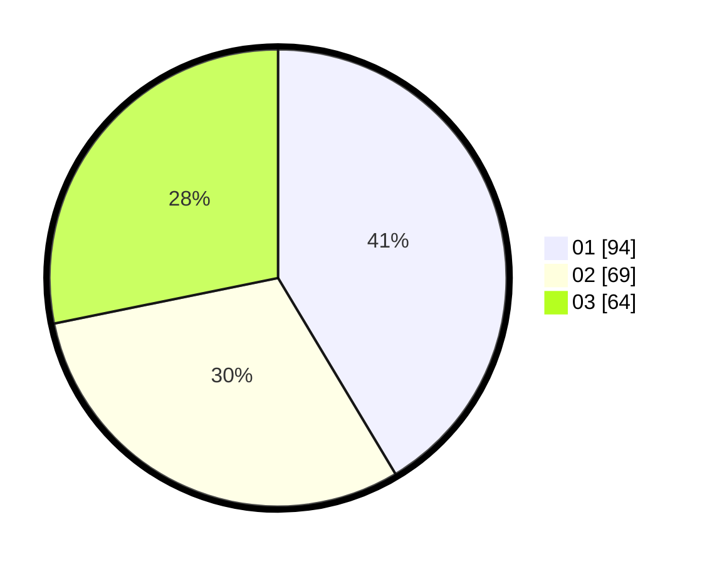

# Hasil

Hasil perolehan suara paslon dapat dilihat pada file paslon-01.txt, paslon-02.txt, dan paslon-03.txt.

Jika tidak ada, artinya data tersebut belum ada pada SIREKAP.

## Perolehan Suara

 * Paslon 01: **94**.
 * Paslon 02: **69**.
 * Paslon 03: **64**.

## Foto C Plano

https://sirekap-obj-formc.kpu.go.id/2f8d/pemilu/ppwp/31/75/07/10/01/3175071001195-20240215-215456--2c401ddc-08ea-4e9d-9543-dcee203559eb.jpg

https://sirekap-obj-formc.kpu.go.id/2f8d/pemilu/ppwp/31/75/07/10/01/3175071001195-20240215-215500--bf79c4de-66b9-4b92-b305-4812fcab1fb0.jpg

https://sirekap-obj-formc.kpu.go.id/2f8d/pemilu/ppwp/31/75/07/10/01/3175071001195-20240215-215458--4a5af959-e0c1-4486-92e5-6ec1a824fb90.jpg

## DATA PEMILIH TETAP

Jumlah pemilih dalam DPT: **264**.
 * L: **122**.
 * P: **142**.

## DATA PENGGUNA HAK PILIH

Jumlah pengguna hak pilih dalam DPT: **264**.
 * L: **122**.
 * P: **142**.

Jumlah pengguna hak pilih dalam DPTb: **6**.
 * L: **2**.
 * P: **4**.

Jumlah pengguna hak pilih dalam DPK: **3**.
 * L: **2**.
 * P: **1**.

Jumlah pengguna hak pilih: **273**.
 * L: **126**.
 * P: **147**.

## JUMLAH SUARA SAH DAN TIDAK SAH

JUMLAH SELURUH SUARA SAH: **227**.

JUMLAH SUARA TIDAK SAH: **2**.

JUMLAH SELURUH SUARA SAH DAN SUARA TIDAK SAH: **229**.
