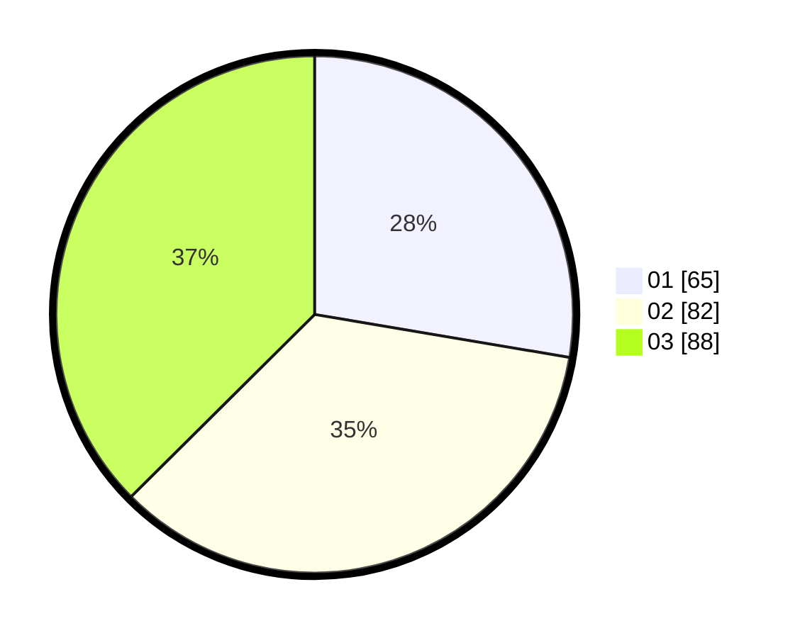

# Hasil

Hasil perolehan suara paslon dapat dilihat pada file paslon-01.txt, paslon-02.txt, dan paslon-03.txt.

Jika tidak ada, artinya data tersebut belum ada pada SIREKAP.

## Perolehan Suara

 * Paslon 01: **65**.
 * Paslon 02: **82**.
 * Paslon 03: **88**.

## Foto C Plano

https://sirekap-obj-formc.kpu.go.id/e17b/pemilu/ppwp/31/75/07/10/01/3175071001197-20240215-050252--c26a4893-5013-4201-980c-7fbfb0ca7580.jpg

https://sirekap-obj-formc.kpu.go.id/e17b/pemilu/ppwp/31/75/07/10/01/3175071001197-20240215-050257--5fac9f32-5c16-4bfb-a082-a03c424ef702.jpg

https://sirekap-obj-formc.kpu.go.id/e17b/pemilu/ppwp/31/75/07/10/01/3175071001197-20240215-050303--7bb08d44-ff5d-4dff-ac77-a68215758b08.jpg
