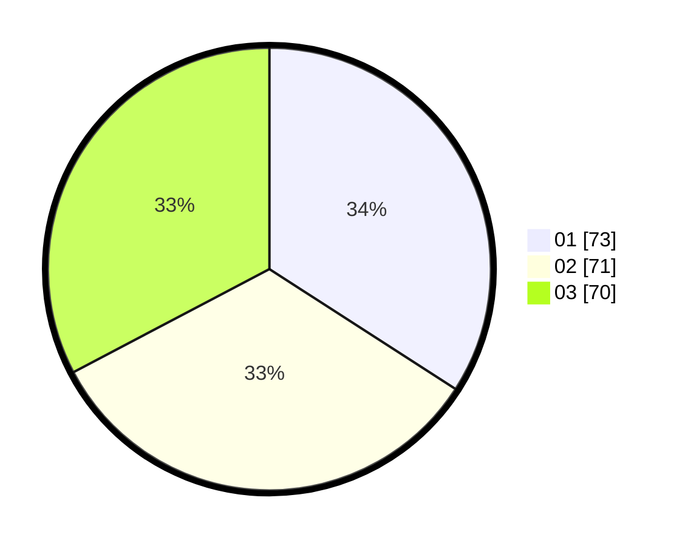

# Hasil

Hasil perolehan suara paslon dapat dilihat pada file paslon-01.txt, paslon-02.txt, dan paslon-03.txt.

Jika tidak ada, artinya data tersebut belum ada pada SIREKAP.

## Perolehan Suara

 * Paslon 01: **73**.
 * Paslon 02: **71**.
 * Paslon 03: **70**.

## Foto C Plano

https://sirekap-obj-formc.kpu.go.id/c87a/pemilu/ppwp/31/75/07/10/01/3175071001202-20240214-155617--ebfa482d-2172-49f9-9dc0-9c1645681110.jpg

https://sirekap-obj-formc.kpu.go.id/c87a/pemilu/ppwp/31/75/07/10/01/3175071001202-20240214-155658--e0024f17-ea30-4a7e-afb3-302a198dfdcf.jpg

https://sirekap-obj-formc.kpu.go.id/c87a/pemilu/ppwp/31/75/07/10/01/3175071001202-20240214-155732--5cc65bef-df4e-4a7b-8cc1-956657040a7a.jpg

## DATA PEMILIH TETAP

Jumlah pemilih dalam DPT: **266**.
 * L: **126**.
 * P: **140**.

## DATA PENGGUNA HAK PILIH

Jumlah pengguna hak pilih dalam DPT: **207**.
 * L: **98**.
 * P: **109**.

Jumlah pengguna hak pilih dalam DPTb: **9**.
 * L: **3**.
 * P: **6**.

Jumlah pengguna hak pilih dalam DPK: **3**.
 * L: **2**.
 * P: **1**.

Jumlah pengguna hak pilih: **219**.
 * L: **0**.
 * P: **0**.

## JUMLAH SUARA SAH DAN TIDAK SAH

JUMLAH SELURUH SUARA SAH: **214**.

JUMLAH SUARA TIDAK SAH: **5**.

JUMLAH SELURUH SUARA SAH DAN SUARA TIDAK SAH: **219**.
