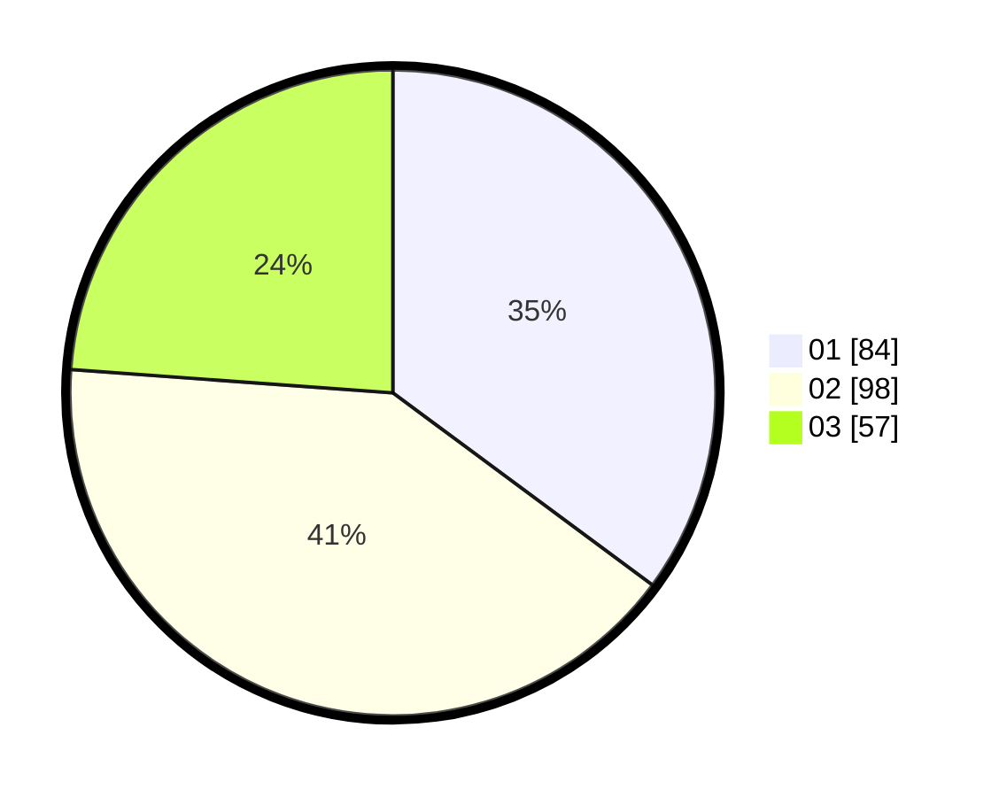

# Hasil

Hasil perolehan suara paslon dapat dilihat pada file paslon-01.txt, paslon-02.txt, dan paslon-03.txt.

Jika tidak ada, artinya data tersebut belum ada pada SIREKAP.

## Perolehan Suara

 * Paslon 01: **84**.
 * Paslon 02: **98**.
 * Paslon 03: **57**.

## Foto C Plano

https://sirekap-obj-formc.kpu.go.id/8107/pemilu/ppwp/31/75/07/10/01/3175071001210-20240214-155017--aec08368-c3f8-4ad0-ae3a-cb72e6ca4a1f.jpg

https://sirekap-obj-formc.kpu.go.id/8107/pemilu/ppwp/31/75/07/10/01/3175071001210-20240214-155159--59a5fb5b-848a-4190-9cd4-e4d43ca66c66.jpg

https://sirekap-obj-formc.kpu.go.id/8107/pemilu/ppwp/31/75/07/10/01/3175071001210-20240216-152457--e4738aba-da01-450f-8031-91338a74a2df.jpg

## DATA PEMILIH TETAP

Jumlah pemilih dalam DPT: **273**.
 * L: **126**.
 * P: **147**.

## DATA PENGGUNA HAK PILIH

Jumlah pengguna hak pilih dalam DPT: **234**.
 * L: **100**.
 * P: **134**.

Jumlah pengguna hak pilih dalam DPTb: **5**.
 * L: **1**.
 * P: **4**.

Jumlah pengguna hak pilih dalam DPK: **2**.
 * L: **2**.
 * P: **0**.

Jumlah pengguna hak pilih: **241**.
 * L: **103**.
 * P: **138**.

## JUMLAH SUARA SAH DAN TIDAK SAH

JUMLAH SELURUH SUARA SAH: **239**.

JUMLAH SUARA TIDAK SAH: **2**.

JUMLAH SELURUH SUARA SAH DAN SUARA TIDAK SAH: **241**.
