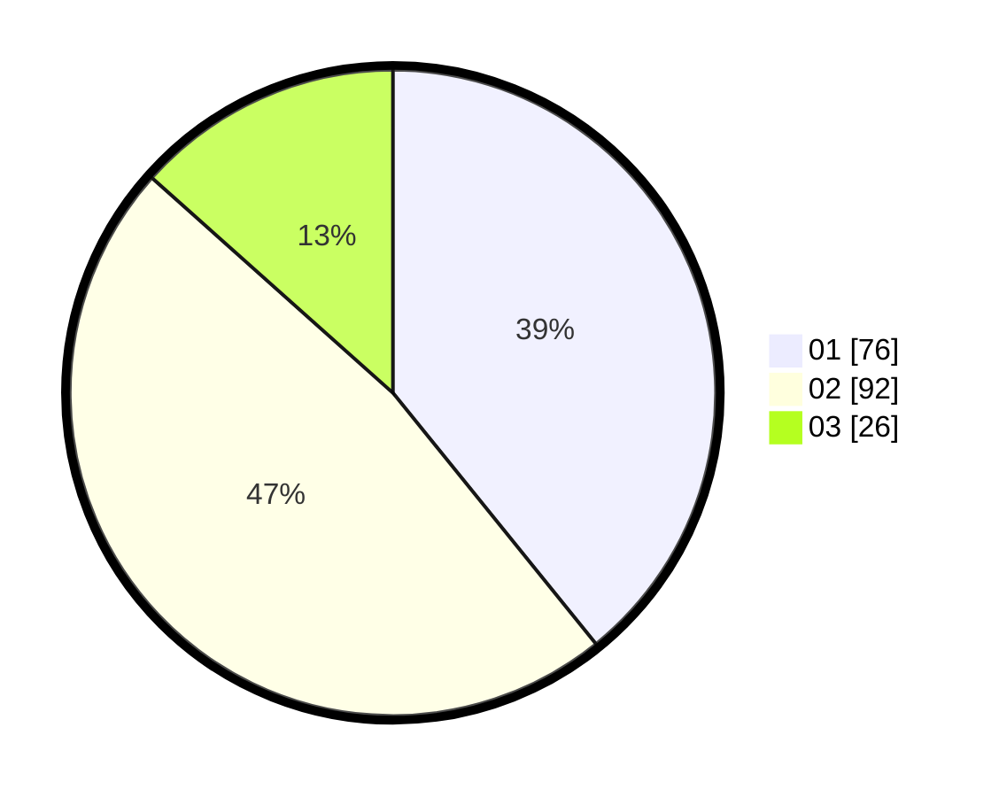

# Hasil

Hasil perolehan suara paslon dapat dilihat pada file paslon-01.txt, paslon-02.txt, dan paslon-03.txt.

Jika tidak ada, artinya data tersebut belum ada pada SIREKAP.

## Perolehan Suara

 * Paslon 01: **76**.
 * Paslon 02: **92**.
 * Paslon 03: **26**.

## Foto C Plano

https://sirekap-obj-formc.kpu.go.id/1623/pemilu/ppwp/31/75/07/10/02/3175071002002-20240214-155051--90228bd2-6a23-409a-939a-6e6fbbf7b6ac.jpg

https://sirekap-obj-formc.kpu.go.id/1623/pemilu/ppwp/31/75/07/10/02/3175071002002-20240215-060226--292a8abe-e94c-4946-bc75-872009e5eb3a.jpg

https://sirekap-obj-formc.kpu.go.id/1623/pemilu/ppwp/31/75/07/10/02/3175071002002-20240215-060217--a77e5198-750a-4b7b-a8b1-23662c271221.jpg

## DATA PEMILIH TETAP

Jumlah pemilih dalam DPT: **259**.
 * L: **133**.
 * P: **126**.

## DATA PENGGUNA HAK PILIH

Jumlah pengguna hak pilih dalam DPT: **191**.
 * L: **93**.
 * P: **98**.

Jumlah pengguna hak pilih dalam DPTb: **0**.
 * L: **0**.
 * P: **0**.

Jumlah pengguna hak pilih dalam DPK: **4**.
 * L: **2**.
 * P: **2**.

Jumlah pengguna hak pilih: **195**.
 * L: **95**.
 * P: **100**.

## JUMLAH SUARA SAH DAN TIDAK SAH

JUMLAH SELURUH SUARA SAH: **194**.

JUMLAH SUARA TIDAK SAH: **1**.

JUMLAH SELURUH SUARA SAH DAN SUARA TIDAK SAH: **195**.
