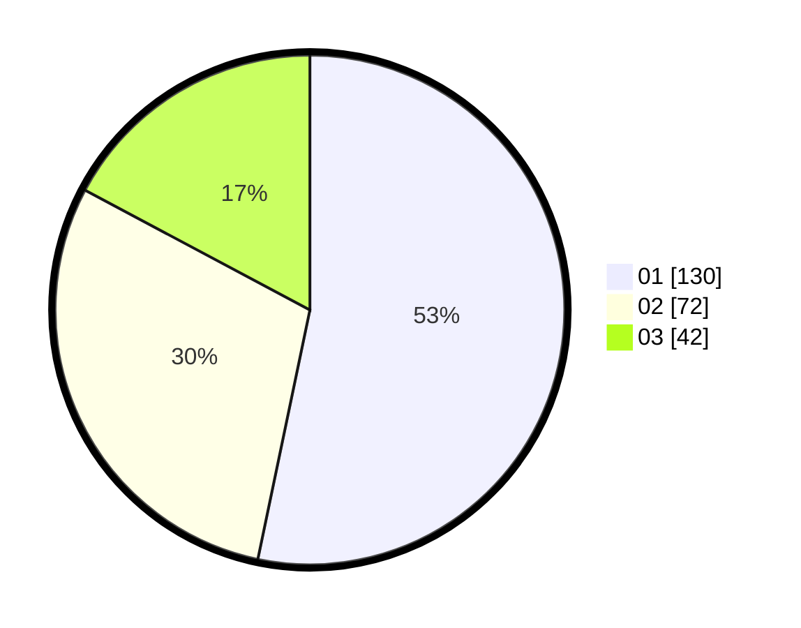

# Hasil

Hasil perolehan suara paslon dapat dilihat pada file paslon-01.txt, paslon-02.txt, dan paslon-03.txt.

Jika tidak ada, artinya data tersebut belum ada pada SIREKAP.

## Perolehan Suara

 * Paslon 01: **130**.
 * Paslon 02: **72**.
 * Paslon 03: **42**.

## Foto C Plano

https://sirekap-obj-formc.kpu.go.id/a46e/pemilu/ppwp/31/75/07/10/02/3175071002009-20240214-192522--6133ba62-72c0-414a-a497-266c6cb9c4ea.jpg

https://sirekap-obj-formc.kpu.go.id/a46e/pemilu/ppwp/31/75/07/10/02/3175071002009-20240214-221558--68921132-1cfd-4f68-af42-2f7d1fd82403.jpg

https://sirekap-obj-formc.kpu.go.id/a46e/pemilu/ppwp/31/75/07/10/02/3175071002009-20240214-193059--792ef1da-f384-427e-a2d8-339547b10208.jpg

## DATA PEMILIH TETAP

Jumlah pemilih dalam DPT: **267**.
 * L: **132**.
 * P: **135**.

## DATA PENGGUNA HAK PILIH

Jumlah pengguna hak pilih dalam DPT: **226**.
 * L: **111**.
 * P: **115**.

Jumlah pengguna hak pilih dalam DPTb: **19**.
 * L: **10**.
 * P: **9**.

Jumlah pengguna hak pilih dalam DPK: **4**.
 * L: **2**.
 * P: **2**.

Jumlah pengguna hak pilih: **249**.
 * L: **123**.
 * P: **126**.

## JUMLAH SUARA SAH DAN TIDAK SAH

JUMLAH SELURUH SUARA SAH: **244**.

JUMLAH SUARA TIDAK SAH: **5**.

JUMLAH SELURUH SUARA SAH DAN SUARA TIDAK SAH: **249**.
