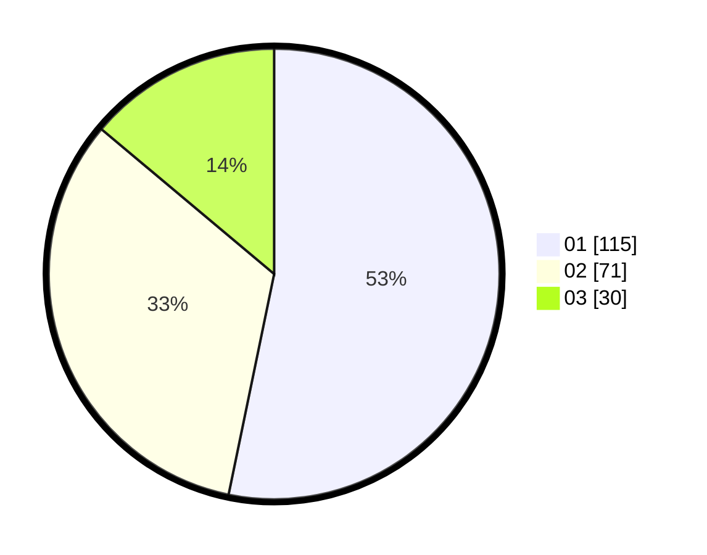

# Hasil

Hasil perolehan suara paslon dapat dilihat pada file paslon-01.txt, paslon-02.txt, dan paslon-03.txt.

Jika tidak ada, artinya data tersebut belum ada pada SIREKAP.

## Perolehan Suara

 * Paslon 01: **115**.
 * Paslon 02: **71**.
 * Paslon 03: **30**.

## Foto C Plano

https://sirekap-obj-formc.kpu.go.id/a057/pemilu/ppwp/31/75/07/10/02/3175071002011-20240214-224912--ba9d87cd-c291-42cc-aec1-5841b127519d.jpg

https://sirekap-obj-formc.kpu.go.id/a057/pemilu/ppwp/31/75/07/10/02/3175071002011-20240214-190221--9e1930d0-b079-45b6-91fc-11f58d6c8f75.jpg

https://sirekap-obj-formc.kpu.go.id/a057/pemilu/ppwp/31/75/07/10/02/3175071002011-20240216-145607--032fb1ea-45a3-40fe-8ff4-989d611cd89d.jpg

## DATA PEMILIH TETAP

Jumlah pemilih dalam DPT: **265**.
 * L: **122**.
 * P: **143**.

## DATA PENGGUNA HAK PILIH

Jumlah pengguna hak pilih dalam DPT: **215**.
 * L: **98**.
 * P: **117**.

Jumlah pengguna hak pilih dalam DPTb: **0**.
 * L: **0**.
 * P: **0**.

Jumlah pengguna hak pilih dalam DPK: **2**.
 * L: **1**.
 * P: **1**.

Jumlah pengguna hak pilih: **217**.
 * L: **99**.
 * P: **118**.

## JUMLAH SUARA SAH DAN TIDAK SAH

JUMLAH SELURUH SUARA SAH: **216**.

JUMLAH SUARA TIDAK SAH: **1**.

JUMLAH SELURUH SUARA SAH DAN SUARA TIDAK SAH: **217**.
