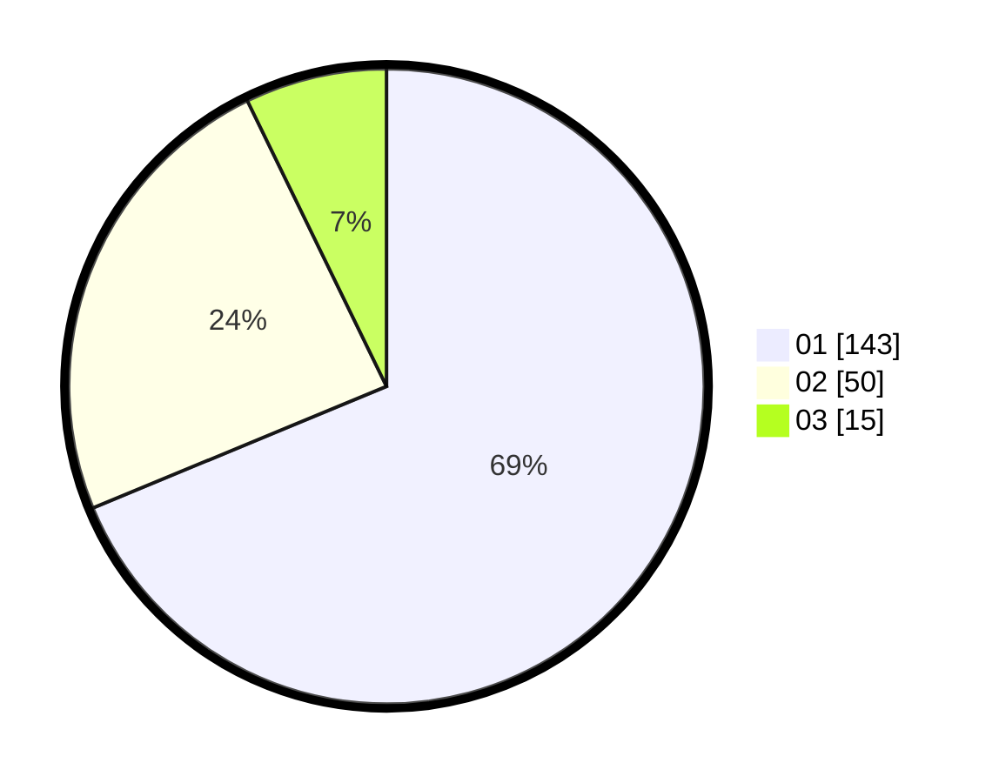

# Hasil

Hasil perolehan suara paslon dapat dilihat pada file paslon-01.txt, paslon-02.txt, dan paslon-03.txt.

Jika tidak ada, artinya data tersebut belum ada pada SIREKAP.

## Perolehan Suara

 * Paslon 01: **143**.
 * Paslon 02: **50**.
 * Paslon 03: **15**.

## Foto C Plano

https://sirekap-obj-formc.kpu.go.id/7fb3/pemilu/ppwp/31/75/07/10/02/3175071002013-20240214-201652--2935ab17-0ea8-473c-86c4-fdd266448728.jpg

https://sirekap-obj-formc.kpu.go.id/7fb3/pemilu/ppwp/31/75/07/10/02/3175071002013-20240214-201936--4d47b0c7-14ce-4372-8549-bbe459a524b8.jpg

https://sirekap-obj-formc.kpu.go.id/7fb3/pemilu/ppwp/31/75/07/10/02/3175071002013-20240215-151643--ad82857a-d434-40bf-b7eb-f65771958b7e.jpg

## DATA PEMILIH TETAP

Jumlah pemilih dalam DPT: **260**.
 * L: **136**.
 * P: **124**.

## DATA PENGGUNA HAK PILIH

Jumlah pengguna hak pilih dalam DPT: **260**.
 * L: **5**.
 * P: **4**.

Jumlah pengguna hak pilih dalam DPTb: **0**.
 * L: **0**.
 * P: **0**.

Jumlah pengguna hak pilih dalam DPK: **0**.
 * L: **1**.
 * P: **0**.

Jumlah pengguna hak pilih: **260**.
 * L: **0**.
 * P: **0**.

## JUMLAH SUARA SAH DAN TIDAK SAH

JUMLAH SELURUH SUARA SAH: **208**.

JUMLAH SUARA TIDAK SAH: **2**.

JUMLAH SELURUH SUARA SAH DAN SUARA TIDAK SAH: **210**.
