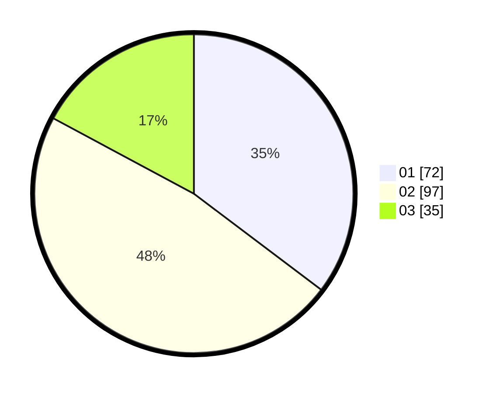

# Hasil

Hasil perolehan suara paslon dapat dilihat pada file paslon-01.txt, paslon-02.txt, dan paslon-03.txt.

Jika tidak ada, artinya data tersebut belum ada pada SIREKAP.

## Perolehan Suara

 * Paslon 01: **72**.
 * Paslon 02: **97**.
 * Paslon 03: **35**.

## Foto C Plano

https://sirekap-obj-formc.kpu.go.id/51c7/pemilu/ppwp/31/75/07/10/02/3175071002016-20240214-204202--c87a7e3d-3170-4e35-81d4-f7b9fe96b88a.jpg

https://sirekap-obj-formc.kpu.go.id/51c7/pemilu/ppwp/31/75/07/10/02/3175071002016-20240214-222156--e0bb07a6-beef-4b89-8c42-dede70a4d8d9.jpg

https://sirekap-obj-formc.kpu.go.id/51c7/pemilu/ppwp/31/75/07/10/02/3175071002016-20240214-222052--e1c56564-84f8-4897-a36b-be2d45830e1f.jpg

## DATA PEMILIH TETAP

Jumlah pemilih dalam DPT: **262**.
 * L: **137**.
 * P: **125**.

## DATA PENGGUNA HAK PILIH

Jumlah pengguna hak pilih dalam DPT: **203**.
 * L: **104**.
 * P: **99**.

Jumlah pengguna hak pilih dalam DPTb: **0**.
 * L: **0**.
 * P: **0**.

Jumlah pengguna hak pilih dalam DPK: **4**.
 * L: **2**.
 * P: **2**.

Jumlah pengguna hak pilih: **207**.
 * L: **106**.
 * P: **101**.

## JUMLAH SUARA SAH DAN TIDAK SAH

JUMLAH SELURUH SUARA SAH: **204**.

JUMLAH SUARA TIDAK SAH: **3**.

JUMLAH SELURUH SUARA SAH DAN SUARA TIDAK SAH: **207**.
