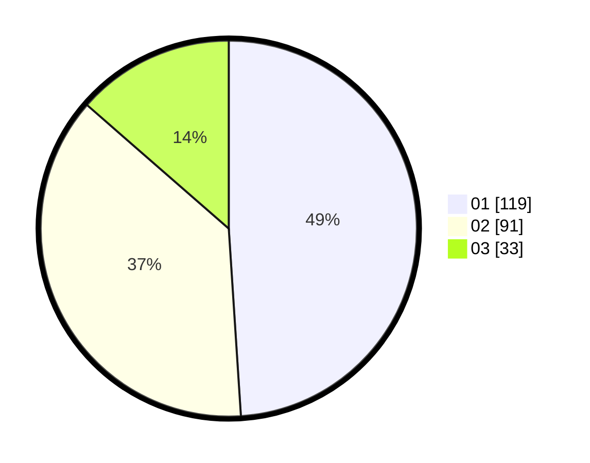

# Hasil

Hasil perolehan suara paslon dapat dilihat pada file paslon-01.txt, paslon-02.txt, dan paslon-03.txt.

Jika tidak ada, artinya data tersebut belum ada pada SIREKAP.

## Perolehan Suara

 * Paslon 01: **119**.
 * Paslon 02: **91**.
 * Paslon 03: **33**.

## Foto C Plano

https://sirekap-obj-formc.kpu.go.id/ae8f/pemilu/ppwp/31/75/07/10/02/3175071002018-20240214-190511--912bb641-532f-4083-adb1-616c809775fd.jpg

https://sirekap-obj-formc.kpu.go.id/ae8f/pemilu/ppwp/31/75/07/10/02/3175071002018-20240214-190520--3785fa7d-821a-460d-970c-0685a5c8f2cb.jpg

https://sirekap-obj-formc.kpu.go.id/ae8f/pemilu/ppwp/31/75/07/10/02/3175071002018-20240214-190525--4548aebc-093b-42da-b540-9a149c4bc996.jpg

## DATA PEMILIH TETAP

Jumlah pemilih dalam DPT: **261**.
 * L: **133**.
 * P: **128**.

## DATA PENGGUNA HAK PILIH

Jumlah pengguna hak pilih dalam DPT: **227**.
 * L: **110**.
 * P: **117**.

Jumlah pengguna hak pilih dalam DPTb: **15**.
 * L: **9**.
 * P: **6**.

Jumlah pengguna hak pilih dalam DPK: **1**.
 * L: **1**.
 * P: **0**.

Jumlah pengguna hak pilih: **243**.
 * L: **120**.
 * P: **123**.

## JUMLAH SUARA SAH DAN TIDAK SAH

JUMLAH SELURUH SUARA SAH: **243**.

JUMLAH SUARA TIDAK SAH: **0**.

JUMLAH SELURUH SUARA SAH DAN SUARA TIDAK SAH: **243**.
