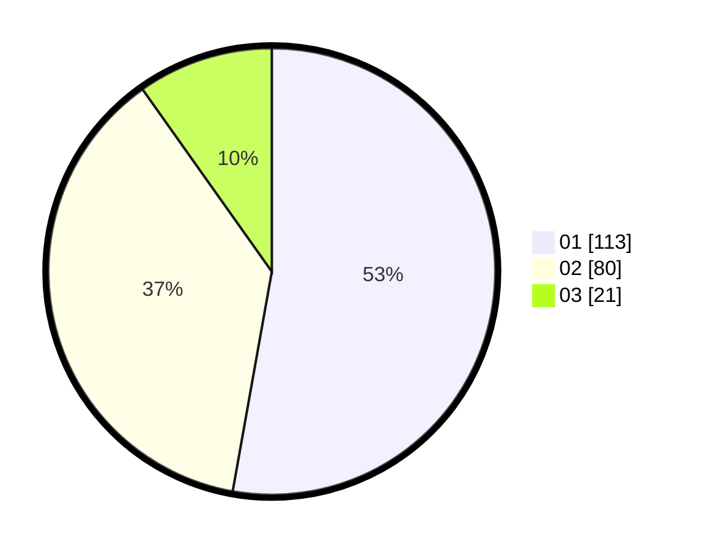

# Hasil

Hasil perolehan suara paslon dapat dilihat pada file paslon-01.txt, paslon-02.txt, dan paslon-03.txt.

Jika tidak ada, artinya data tersebut belum ada pada SIREKAP.

## Perolehan Suara

 * Paslon 01: **113**.
 * Paslon 02: **80**.
 * Paslon 03: **21**.

## Foto C Plano

https://sirekap-obj-formc.kpu.go.id/25a2/pemilu/ppwp/31/75/07/10/02/3175071002021-20240214-184956--a13ff2f5-6a1b-415f-8a89-af6ec84f9de9.jpg

https://sirekap-obj-formc.kpu.go.id/25a2/pemilu/ppwp/31/75/07/10/02/3175071002021-20240214-185054--02d150e6-d885-4ddf-be5c-2f7e3daf81ac.jpg

https://sirekap-obj-formc.kpu.go.id/25a2/pemilu/ppwp/31/75/07/10/02/3175071002021-20240214-191021--558853ef-0ed4-4687-940f-089f9733ecf0.jpg

## DATA PEMILIH TETAP

Jumlah pemilih dalam DPT: **292**.
 * L: **148**.
 * P: **144**.

## DATA PENGGUNA HAK PILIH

Jumlah pengguna hak pilih dalam DPT: **210**.
 * L: **107**.
 * P: **103**.

Jumlah pengguna hak pilih dalam DPTb: **4**.
 * L: **2**.
 * P: **2**.

Jumlah pengguna hak pilih dalam DPK: **1**.
 * L: **0**.
 * P: **1**.

Jumlah pengguna hak pilih: **215**.
 * L: **109**.
 * P: **106**.

## JUMLAH SUARA SAH DAN TIDAK SAH

JUMLAH SELURUH SUARA SAH: **214**.

JUMLAH SUARA TIDAK SAH: **1**.

JUMLAH SELURUH SUARA SAH DAN SUARA TIDAK SAH: **215**.
