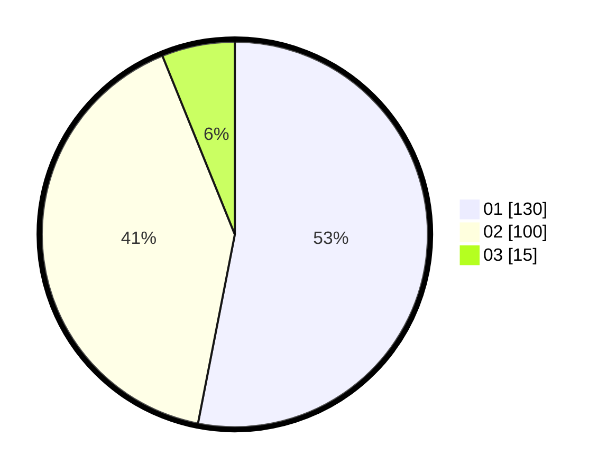

# Hasil

Hasil perolehan suara paslon dapat dilihat pada file paslon-01.txt, paslon-02.txt, dan paslon-03.txt.

Jika tidak ada, artinya data tersebut belum ada pada SIREKAP.

## Perolehan Suara

 * Paslon 01: **130**.
 * Paslon 02: **100**.
 * Paslon 03: **15**.

## Foto C Plano

https://sirekap-obj-formc.kpu.go.id/12e3/pemilu/ppwp/31/75/07/10/02/3175071002022-20240214-224026--cf1c8ed1-6cc0-40ae-b1c0-1122bcc004c0.jpg

https://sirekap-obj-formc.kpu.go.id/12e3/pemilu/ppwp/31/75/07/10/02/3175071002022-20240214-223551--3f7e60b8-7a26-409a-9edc-02a6a11e6c1c.jpg

https://sirekap-obj-formc.kpu.go.id/12e3/pemilu/ppwp/31/75/07/10/02/3175071002022-20240214-223649--b7425a59-56ec-4e33-bcdb-befb4409e77e.jpg

## DATA PEMILIH TETAP

Jumlah pemilih dalam DPT: **291**.
 * L: **141**.
 * P: **150**.

## DATA PENGGUNA HAK PILIH

Jumlah pengguna hak pilih dalam DPT: **233**.
 * L: **112**.
 * P: **121**.

Jumlah pengguna hak pilih dalam DPTb: **6**.
 * L: **4**.
 * P: **2**.

Jumlah pengguna hak pilih dalam DPK: **6**.
 * L: **3**.
 * P: **3**.

Jumlah pengguna hak pilih: **235**.
 * L: **113**.
 * P: **126**.

## JUMLAH SUARA SAH DAN TIDAK SAH

JUMLAH SELURUH SUARA SAH: **245**.

JUMLAH SUARA TIDAK SAH: **0**.

JUMLAH SELURUH SUARA SAH DAN SUARA TIDAK SAH: **245**.
