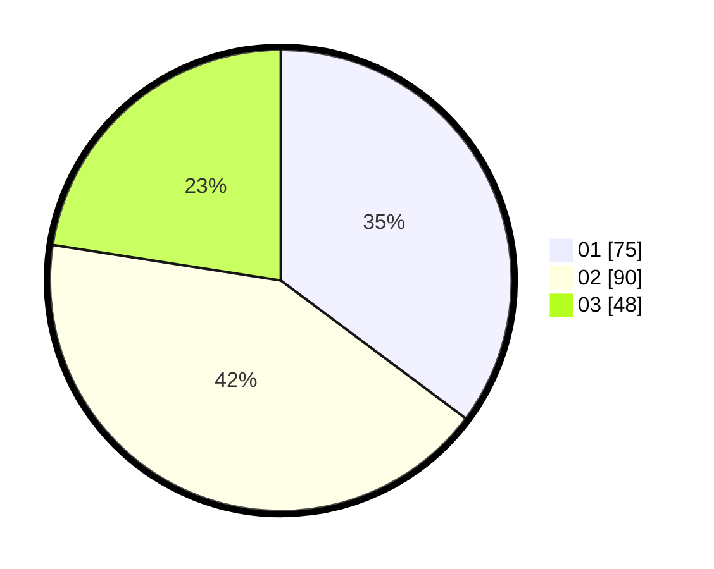

# Hasil

Hasil perolehan suara paslon dapat dilihat pada file paslon-01.txt, paslon-02.txt, dan paslon-03.txt.

Jika tidak ada, artinya data tersebut belum ada pada SIREKAP.

## Perolehan Suara

 * Paslon 01: **75**.
 * Paslon 02: **90**.
 * Paslon 03: **48**.

## Foto C Plano

https://sirekap-obj-formc.kpu.go.id/7167/pemilu/ppwp/31/75/07/10/02/3175071002023-20240215-010642--8e32fe23-b910-47d1-a31d-1bc18b490e3a.jpg

https://sirekap-obj-formc.kpu.go.id/7167/pemilu/ppwp/31/75/07/10/02/3175071002023-20240215-010829--91497b1b-0374-4ad6-b201-c1fdcb265d35.jpg

https://sirekap-obj-formc.kpu.go.id/7167/pemilu/ppwp/31/75/07/10/02/3175071002023-20240215-010923--3242e4ed-801e-4b8e-8184-0a3184b2aa26.jpg
