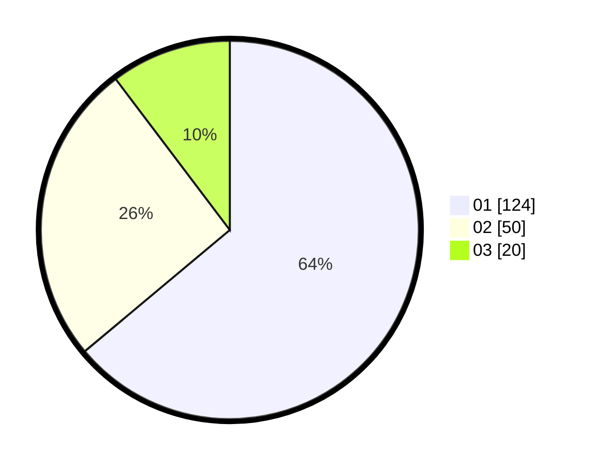

# Hasil

Hasil perolehan suara paslon dapat dilihat pada file paslon-01.txt, paslon-02.txt, dan paslon-03.txt.

Jika tidak ada, artinya data tersebut belum ada pada SIREKAP.

## Perolehan Suara

 * Paslon 01: **124**.
 * Paslon 02: **50**.
 * Paslon 03: **20**.

## Foto C Plano

https://sirekap-obj-formc.kpu.go.id/8a54/pemilu/ppwp/31/75/07/10/02/3175071002028-20240214-210943--caa45a1b-d15e-4b20-a90b-cbb9447fc37f.jpg

https://sirekap-obj-formc.kpu.go.id/8a54/pemilu/ppwp/31/75/07/10/02/3175071002028-20240214-210956--2ec64424-32cb-4d75-95ea-a0e7fc2eda79.jpg

https://sirekap-obj-formc.kpu.go.id/8a54/pemilu/ppwp/31/75/07/10/02/3175071002028-20240214-211011--7311330d-9ab9-4268-b599-54c6dfff42b2.jpg

## DATA PEMILIH TETAP

Jumlah pemilih dalam DPT: **259**.
 * L: **129**.
 * P: **130**.

## DATA PENGGUNA HAK PILIH

Jumlah pengguna hak pilih dalam DPT: **188**.
 * L: **90**.
 * P: **98**.

Jumlah pengguna hak pilih dalam DPTb: **1**.
 * L: **0**.
 * P: **1**.

Jumlah pengguna hak pilih dalam DPK: **5**.
 * L: **1**.
 * P: **4**.

Jumlah pengguna hak pilih: **194**.
 * L: **91**.
 * P: **103**.

## JUMLAH SUARA SAH DAN TIDAK SAH

JUMLAH SELURUH SUARA SAH: **194**.

JUMLAH SUARA TIDAK SAH: **0**.

JUMLAH SELURUH SUARA SAH DAN SUARA TIDAK SAH: **194**.
