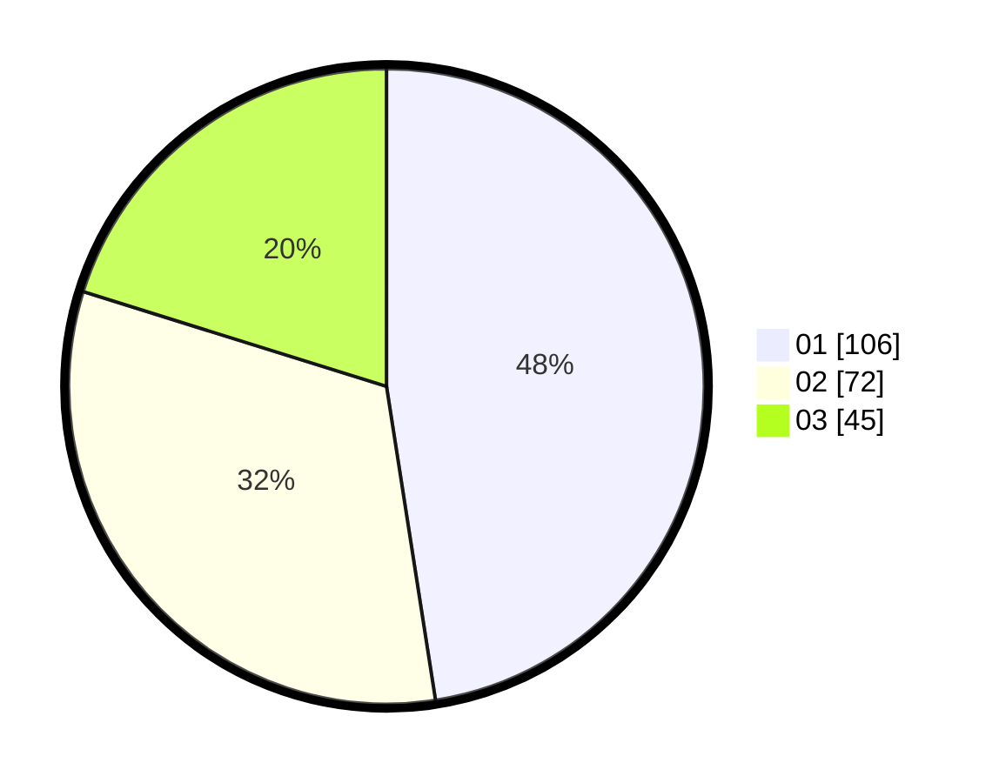

# Hasil

Hasil perolehan suara paslon dapat dilihat pada file paslon-01.txt, paslon-02.txt, dan paslon-03.txt.

Jika tidak ada, artinya data tersebut belum ada pada SIREKAP.

## Perolehan Suara

 * Paslon 01: **106**.
 * Paslon 02: **72**.
 * Paslon 03: **45**.

## Foto C Plano

https://sirekap-obj-formc.kpu.go.id/409c/pemilu/ppwp/31/75/07/10/02/3175071002029-20240214-185402--5e3e51fb-1cdb-4250-b04e-dbd8c33e8734.jpg

https://sirekap-obj-formc.kpu.go.id/409c/pemilu/ppwp/31/75/07/10/02/3175071002029-20240214-185349--02368d1d-f031-4e7d-9750-52009062e51e.jpg

https://sirekap-obj-formc.kpu.go.id/409c/pemilu/ppwp/31/75/07/10/02/3175071002029-20240214-185120--f3a2d98f-bd25-4433-8e93-0666f9d120ea.jpg

## DATA PEMILIH TETAP

Jumlah pemilih dalam DPT: **263**.
 * L: **127**.
 * P: **136**.

## DATA PENGGUNA HAK PILIH

Jumlah pengguna hak pilih dalam DPT: **218**.
 * L: **105**.
 * P: **113**.

Jumlah pengguna hak pilih dalam DPTb: **1**.
 * L: **0**.
 * P: **1**.

Jumlah pengguna hak pilih dalam DPK: **7**.
 * L: **1**.
 * P: **6**.

Jumlah pengguna hak pilih: **226**.
 * L: **106**.
 * P: **120**.

## JUMLAH SUARA SAH DAN TIDAK SAH

JUMLAH SELURUH SUARA SAH: **223**.

JUMLAH SUARA TIDAK SAH: **3**.

JUMLAH SELURUH SUARA SAH DAN SUARA TIDAK SAH: **226**.
