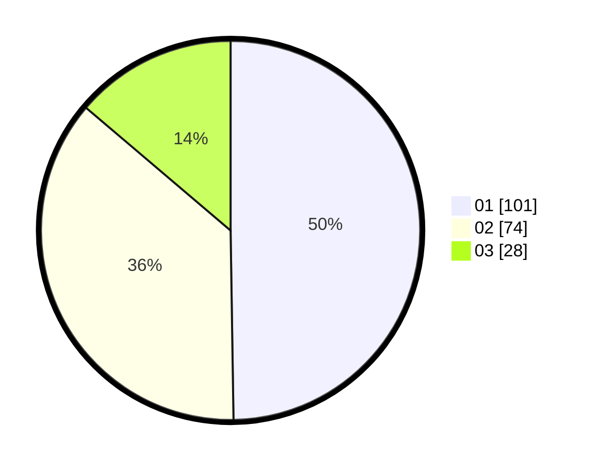

# Hasil

Hasil perolehan suara paslon dapat dilihat pada file paslon-01.txt, paslon-02.txt, dan paslon-03.txt.

Jika tidak ada, artinya data tersebut belum ada pada SIREKAP.

## Perolehan Suara

 * Paslon 01: **101**.
 * Paslon 02: **74**.
 * Paslon 03: **28**.

## Foto C Plano

https://sirekap-obj-formc.kpu.go.id/1031/pemilu/ppwp/31/75/07/10/02/3175071002030-20240214-194215--8a07fcb9-6b2d-4da7-aba4-a4afed204e6c.jpg

https://sirekap-obj-formc.kpu.go.id/1031/pemilu/ppwp/31/75/07/10/02/3175071002030-20240214-203544--d941aba8-c6a3-4243-ab99-417549acc84f.jpg

https://sirekap-obj-formc.kpu.go.id/1031/pemilu/ppwp/31/75/07/10/02/3175071002030-20240214-204346--68605c58-983e-420b-bd0f-64375c6e7ef2.jpg

## DATA PEMILIH TETAP

Jumlah pemilih dalam DPT: **263**.
 * L: **131**.
 * P: **132**.

## DATA PENGGUNA HAK PILIH

Jumlah pengguna hak pilih dalam DPT: **201**.
 * L: **96**.
 * P: **105**.

Jumlah pengguna hak pilih dalam DPTb: **1**.
 * L: **8**.
 * P: **1**.

Jumlah pengguna hak pilih dalam DPK: **3**.
 * L: **2**.
 * P: **1**.

Jumlah pengguna hak pilih: **205**.
 * L: **98**.
 * P: **107**.

## JUMLAH SUARA SAH DAN TIDAK SAH

JUMLAH SELURUH SUARA SAH: **203**.

JUMLAH SUARA TIDAK SAH: **2**.

JUMLAH SELURUH SUARA SAH DAN SUARA TIDAK SAH: **205**.
