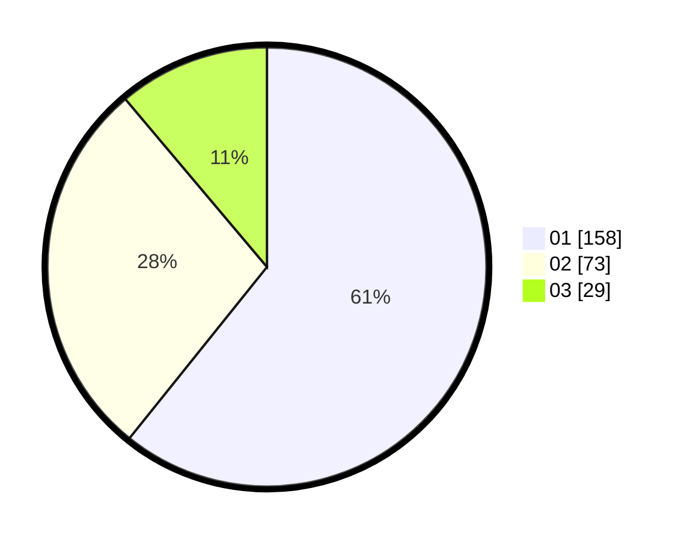

# Hasil

Hasil perolehan suara paslon dapat dilihat pada file paslon-01.txt, paslon-02.txt, dan paslon-03.txt.

Jika tidak ada, artinya data tersebut belum ada pada SIREKAP.

## Perolehan Suara

 * Paslon 01: **158**.
 * Paslon 02: **73**.
 * Paslon 03: **29**.

## Foto C Plano

https://sirekap-obj-formc.kpu.go.id/09dc/pemilu/ppwp/31/75/07/10/02/3175071002031-20240214-204147--ed0e50a5-8d84-47a0-8a09-22b9b997c23c.jpg

https://sirekap-obj-formc.kpu.go.id/09dc/pemilu/ppwp/31/75/07/10/02/3175071002031-20240214-204153--f6dc432b-37c7-430c-a46e-f247bc676bf3.jpg

https://sirekap-obj-formc.kpu.go.id/09dc/pemilu/ppwp/31/75/07/10/02/3175071002031-20240214-225221--2ddffcf1-0dc1-4dca-af8d-cd8c9d39079b.jpg

## DATA PEMILIH TETAP

Jumlah pemilih dalam DPT: **276**.
 * L: **133**.
 * P: **143**.

## DATA PENGGUNA HAK PILIH

Jumlah pengguna hak pilih dalam DPT: **244**.
 * L: **114**.
 * P: **130**.

Jumlah pengguna hak pilih dalam DPTb: **19**.
 * L: **9**.
 * P: **10**.

Jumlah pengguna hak pilih dalam DPK: **3**.
 * L: **2**.
 * P: **1**.

Jumlah pengguna hak pilih: **266**.
 * L: **125**.
 * P: **141**.

## JUMLAH SUARA SAH DAN TIDAK SAH

JUMLAH SELURUH SUARA SAH: **260**.

JUMLAH SUARA TIDAK SAH: **6**.

JUMLAH SELURUH SUARA SAH DAN SUARA TIDAK SAH: **266**.
