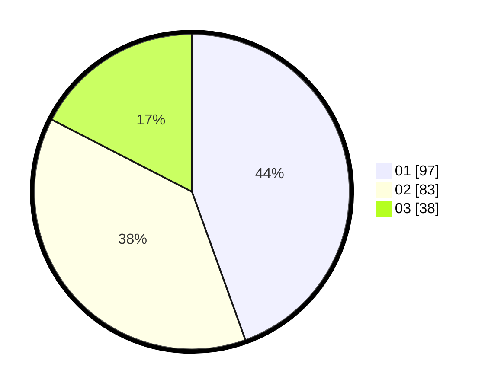

# Hasil

Hasil perolehan suara paslon dapat dilihat pada file paslon-01.txt, paslon-02.txt, dan paslon-03.txt.

Jika tidak ada, artinya data tersebut belum ada pada SIREKAP.

## Perolehan Suara

 * Paslon 01: **97**.
 * Paslon 02: **83**.
 * Paslon 03: **38**.

## Foto C Plano

https://sirekap-obj-formc.kpu.go.id/c004/pemilu/ppwp/31/75/07/10/02/3175071002035-20240214-185220--ea53808d-18de-4942-8836-d04f40665b15.jpg

https://sirekap-obj-formc.kpu.go.id/c004/pemilu/ppwp/31/75/07/10/02/3175071002035-20240214-185428--d513c325-2fa3-450b-be36-d25d14f62f90.jpg

https://sirekap-obj-formc.kpu.go.id/c004/pemilu/ppwp/31/75/07/10/02/3175071002035-20240214-185742--9225e3aa-6ac8-4b27-bd0c-7f142b37b301.jpg

## DATA PEMILIH TETAP

Jumlah pemilih dalam DPT: **261**.
 * L: **138**.
 * P: **123**.

## DATA PENGGUNA HAK PILIH

Jumlah pengguna hak pilih dalam DPT: **218**.
 * L: **114**.
 * P: **104**.

Jumlah pengguna hak pilih dalam DPTb: **1**.
 * L: **0**.
 * P: **0**.

Jumlah pengguna hak pilih dalam DPK: **0**.
 * L: **0**.
 * P: **0**.

Jumlah pengguna hak pilih: **219**.
 * L: **114**.
 * P: **105**.

## JUMLAH SUARA SAH DAN TIDAK SAH

JUMLAH SELURUH SUARA SAH: **218**.

JUMLAH SUARA TIDAK SAH: **1**.

JUMLAH SELURUH SUARA SAH DAN SUARA TIDAK SAH: **219**.
