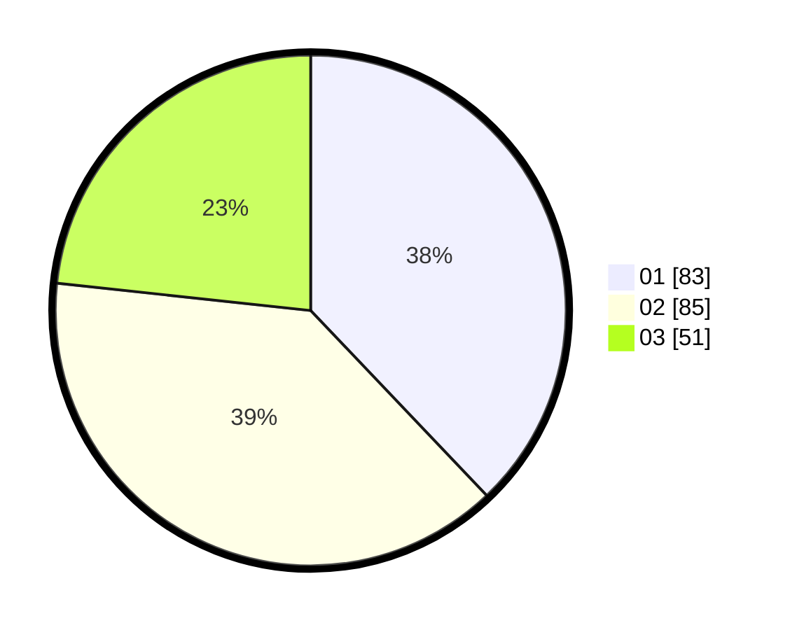

# Hasil

Hasil perolehan suara paslon dapat dilihat pada file paslon-01.txt, paslon-02.txt, dan paslon-03.txt.

Jika tidak ada, artinya data tersebut belum ada pada SIREKAP.

## Perolehan Suara

 * Paslon 01: **83**.
 * Paslon 02: **85**.
 * Paslon 03: **51**.

## Foto C Plano

https://sirekap-obj-formc.kpu.go.id/a29f/pemilu/ppwp/31/75/07/10/02/3175071002037-20240214-231813--d957b6b1-6fb8-4b73-93cc-d45d19cafcf3.jpg

https://sirekap-obj-formc.kpu.go.id/a29f/pemilu/ppwp/31/75/07/10/02/3175071002037-20240214-231850--44b23b0f-efd1-4d26-9110-a46602252c52.jpg

https://sirekap-obj-formc.kpu.go.id/a29f/pemilu/ppwp/31/75/07/10/02/3175071002037-20240214-231947--bbc5befe-2d01-4702-9ec0-33cd2dfb43f9.jpg

## DATA PEMILIH TETAP

Jumlah pemilih dalam DPT: **267**.
 * L: **122**.
 * P: **145**.

## DATA PENGGUNA HAK PILIH

Jumlah pengguna hak pilih dalam DPT: **221**.
 * L: **94**.
 * P: **127**.

Jumlah pengguna hak pilih dalam DPTb: **1**.
 * L: **1**.
 * P: **0**.

Jumlah pengguna hak pilih dalam DPK: **0**.
 * L: **0**.
 * P: **0**.

Jumlah pengguna hak pilih: **222**.
 * L: **95**.
 * P: **127**.

## JUMLAH SUARA SAH DAN TIDAK SAH

JUMLAH SELURUH SUARA SAH: **219**.

JUMLAH SUARA TIDAK SAH: **3**.

JUMLAH SELURUH SUARA SAH DAN SUARA TIDAK SAH: **222**.
