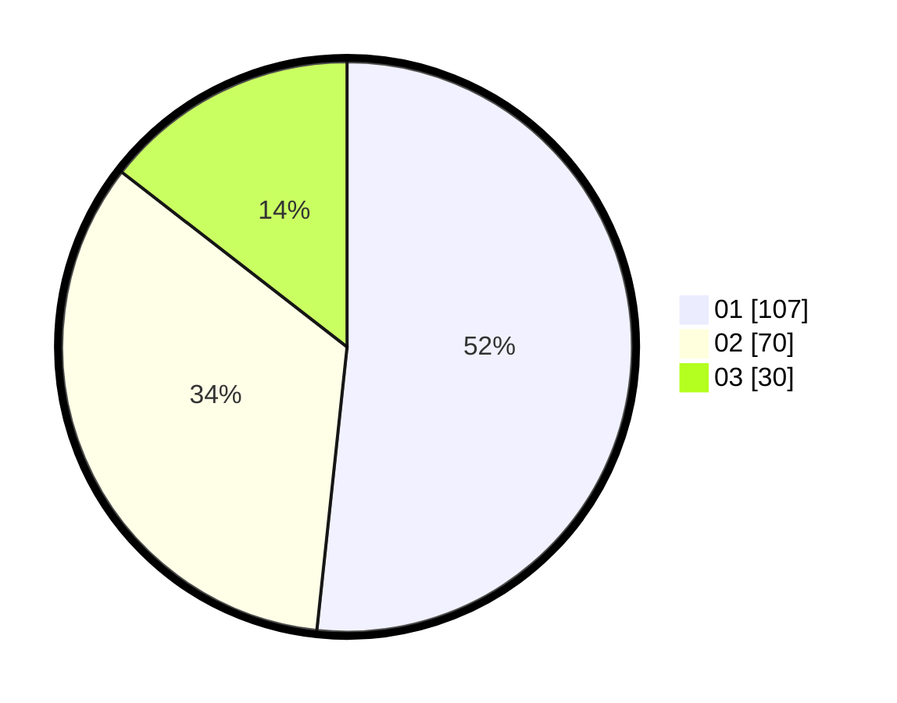

# Hasil

Hasil perolehan suara paslon dapat dilihat pada file paslon-01.txt, paslon-02.txt, dan paslon-03.txt.

Jika tidak ada, artinya data tersebut belum ada pada SIREKAP.

## Perolehan Suara

 * Paslon 01: **107**.
 * Paslon 02: **70**.
 * Paslon 03: **30**.

## Foto C Plano

https://sirekap-obj-formc.kpu.go.id/aefd/pemilu/ppwp/31/75/07/10/02/3175071002039-20240214-231428--11608132-376d-47ef-85ef-38a18abec4fc.jpg

https://sirekap-obj-formc.kpu.go.id/aefd/pemilu/ppwp/31/75/07/10/02/3175071002039-20240214-232344--d4ba86dd-91e2-4cde-afeb-1d675c87218b.jpg

https://sirekap-obj-formc.kpu.go.id/aefd/pemilu/ppwp/31/75/07/10/02/3175071002039-20240214-232350--48ec8250-12c0-450a-aaf0-a32741f28d5a.jpg
