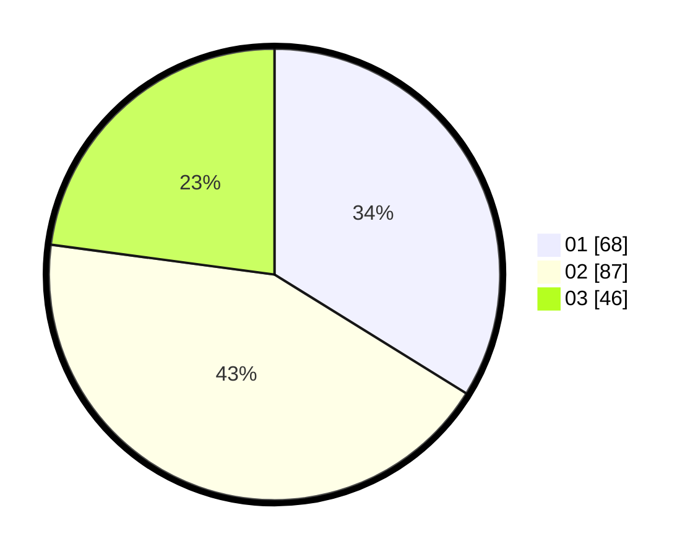

# Hasil

Hasil perolehan suara paslon dapat dilihat pada file paslon-01.txt, paslon-02.txt, dan paslon-03.txt.

Jika tidak ada, artinya data tersebut belum ada pada SIREKAP.

## Perolehan Suara

 * Paslon 01: **68**.
 * Paslon 02: **87**.
 * Paslon 03: **46**.

## Foto C Plano

https://sirekap-obj-formc.kpu.go.id/1bc2/pemilu/ppwp/31/75/07/10/02/3175071002043-20240217-055830--af3b022e-eb52-4b50-abb0-5ac8d281c8be.jpg

https://sirekap-obj-formc.kpu.go.id/1bc2/pemilu/ppwp/31/75/07/10/02/3175071002043-20240217-055831--05a0cbb9-6ccf-442a-aca3-b1252afd8baf.jpg

https://sirekap-obj-formc.kpu.go.id/1bc2/pemilu/ppwp/31/75/07/10/02/3175071002043-20240217-055830--48c7fe0a-34ad-4e74-80ac-597a27c4a575.jpg

## DATA PEMILIH TETAP

Jumlah pemilih dalam DPT: **263**.
 * L: **130**.
 * P: **133**.

## DATA PENGGUNA HAK PILIH

Jumlah pengguna hak pilih dalam DPT: **200**.
 * L: **96**.
 * P: **104**.

Jumlah pengguna hak pilih dalam DPTb: **1**.
 * L: **0**.
 * P: **1**.

Jumlah pengguna hak pilih dalam DPK: **2**.
 * L: **0**.
 * P: **2**.

Jumlah pengguna hak pilih: **203**.
 * L: **96**.
 * P: **107**.

## JUMLAH SUARA SAH DAN TIDAK SAH

JUMLAH SELURUH SUARA SAH: **201**.

JUMLAH SUARA TIDAK SAH: **2**.

JUMLAH SELURUH SUARA SAH DAN SUARA TIDAK SAH: **203**.
