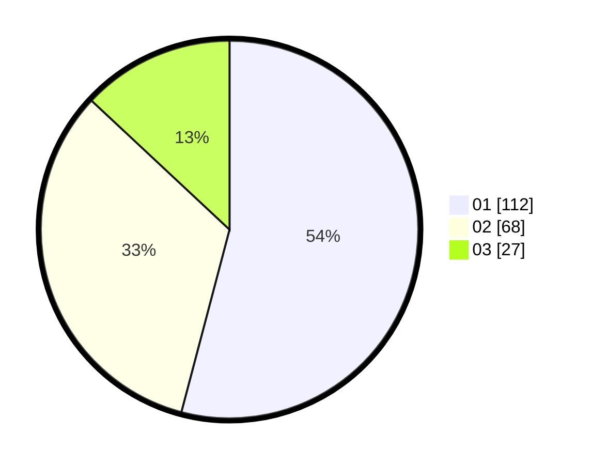

# Hasil

Hasil perolehan suara paslon dapat dilihat pada file paslon-01.txt, paslon-02.txt, dan paslon-03.txt.

Jika tidak ada, artinya data tersebut belum ada pada SIREKAP.

## Perolehan Suara

 * Paslon 01: **112**.
 * Paslon 02: **68**.
 * Paslon 03: **27**.

## Foto C Plano

https://sirekap-obj-formc.kpu.go.id/b6e0/pemilu/ppwp/31/75/07/10/02/3175071002046-20240215-010506--7cd349e8-cd85-42a5-ae9d-3831dd5506b4.jpg

https://sirekap-obj-formc.kpu.go.id/b6e0/pemilu/ppwp/31/75/07/10/02/3175071002046-20240215-010632--fc96d759-4705-47b6-a8f7-6615b50b5f5f.jpg

https://sirekap-obj-formc.kpu.go.id/b6e0/pemilu/ppwp/31/75/07/10/02/3175071002046-20240215-010815--24550a5e-3abd-462b-af56-38c855f61445.jpg
