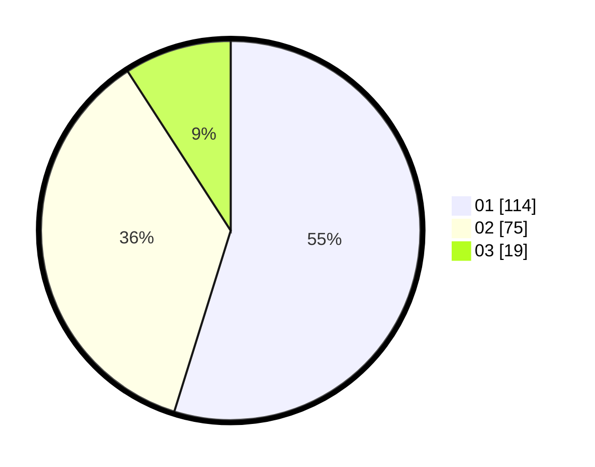

# Hasil

Hasil perolehan suara paslon dapat dilihat pada file paslon-01.txt, paslon-02.txt, dan paslon-03.txt.

Jika tidak ada, artinya data tersebut belum ada pada SIREKAP.

## Perolehan Suara

 * Paslon 01: **114**.
 * Paslon 02: **75**.
 * Paslon 03: **19**.

## Foto C Plano

https://sirekap-obj-formc.kpu.go.id/635f/pemilu/ppwp/31/75/07/10/02/3175071002049-20240216-005524--d5ab83ed-78f6-4e4b-afad-c2407368dac8.jpg

https://sirekap-obj-formc.kpu.go.id/635f/pemilu/ppwp/31/75/07/10/02/3175071002049-20240216-005536--4ead9ce2-f90f-46cd-a846-29d9f07dd9f7.jpg

https://sirekap-obj-formc.kpu.go.id/635f/pemilu/ppwp/31/75/07/10/02/3175071002049-20240216-005534--3723c3c1-bae5-4972-a5c2-21394919669a.jpg

## DATA PEMILIH TETAP

Jumlah pemilih dalam DPT: **270**.
 * L: **143**.
 * P: **127**.

## DATA PENGGUNA HAK PILIH

Jumlah pengguna hak pilih dalam DPT: **208**.
 * L: **103**.
 * P: **105**.

Jumlah pengguna hak pilih dalam DPTb: **0**.
 * L: **0**.
 * P: **0**.

Jumlah pengguna hak pilih dalam DPK: **0**.
 * L: **0**.
 * P: **0**.

Jumlah pengguna hak pilih: **208**.
 * L: **103**.
 * P: **105**.

## JUMLAH SUARA SAH DAN TIDAK SAH

JUMLAH SELURUH SUARA SAH: **208**.

JUMLAH SUARA TIDAK SAH: **0**.

JUMLAH SELURUH SUARA SAH DAN SUARA TIDAK SAH: **208**.
