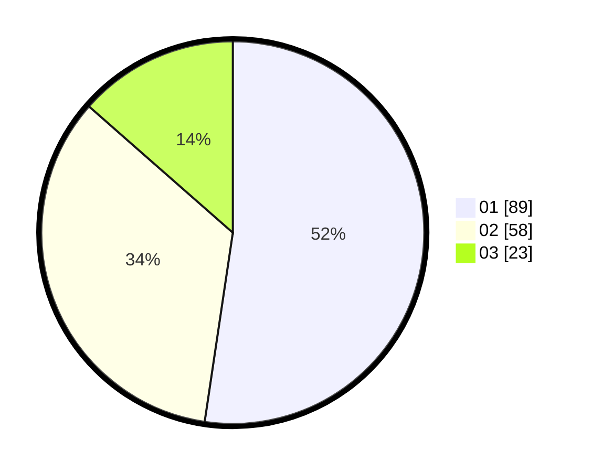

# Hasil

Hasil perolehan suara paslon dapat dilihat pada file paslon-01.txt, paslon-02.txt, dan paslon-03.txt.

Jika tidak ada, artinya data tersebut belum ada pada SIREKAP.

## Perolehan Suara

 * Paslon 01: **89**.
 * Paslon 02: **58**.
 * Paslon 03: **23**.

## Foto C Plano

https://sirekap-obj-formc.kpu.go.id/cc18/pemilu/ppwp/31/75/07/10/02/3175071002053-20240214-210352--aad677f8-7e62-4440-8cab-12055bfc6d86.jpg

https://sirekap-obj-formc.kpu.go.id/cc18/pemilu/ppwp/31/75/07/10/02/3175071002053-20240214-201720--5f68d07a-2f68-47b0-bdbf-a35f4caf1117.jpg

https://sirekap-obj-formc.kpu.go.id/cc18/pemilu/ppwp/31/75/07/10/02/3175071002053-20240214-195633--0ec29e84-252d-478a-80a5-ce225ccee480.jpg

## DATA PEMILIH TETAP

Jumlah pemilih dalam DPT: **230**.
 * L: **119**.
 * P: **111**.

## DATA PENGGUNA HAK PILIH

Jumlah pengguna hak pilih dalam DPT: **171**.
 * L: **89**.
 * P: **82**.

Jumlah pengguna hak pilih dalam DPTb: **0**.
 * L: **0**.
 * P: **0**.

Jumlah pengguna hak pilih dalam DPK: **0**.
 * L: **0**.
 * P: **0**.

Jumlah pengguna hak pilih: **171**.
 * L: **89**.
 * P: **82**.

## JUMLAH SUARA SAH DAN TIDAK SAH

JUMLAH SELURUH SUARA SAH: **170**.

JUMLAH SUARA TIDAK SAH: **1**.

JUMLAH SELURUH SUARA SAH DAN SUARA TIDAK SAH: **171**.
