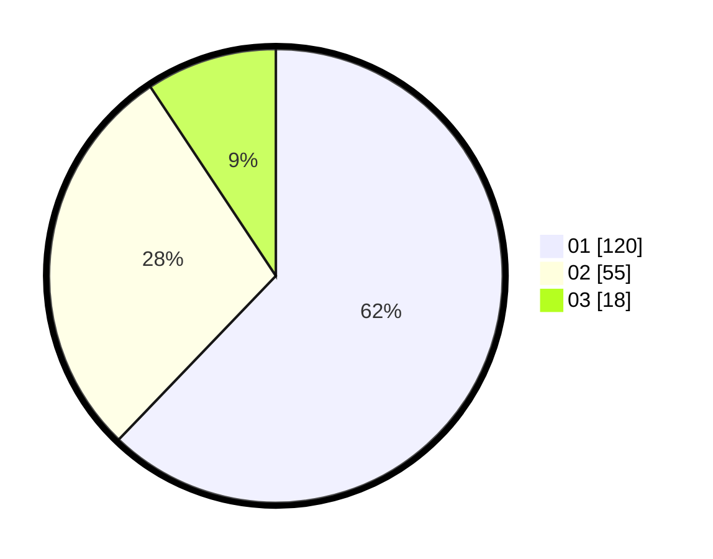

# Hasil

Hasil perolehan suara paslon dapat dilihat pada file paslon-01.txt, paslon-02.txt, dan paslon-03.txt.

Jika tidak ada, artinya data tersebut belum ada pada SIREKAP.

## Perolehan Suara

 * Paslon 01: **120**.
 * Paslon 02: **55**.
 * Paslon 03: **18**.

## Foto C Plano

https://sirekap-obj-formc.kpu.go.id/9e69/pemilu/ppwp/31/75/07/10/02/3175071002054-20240214-155439--8cdaaa04-eddc-4a02-8df1-dc491377ef9f.jpg

https://sirekap-obj-formc.kpu.go.id/9e69/pemilu/ppwp/31/75/07/10/02/3175071002054-20240214-160123--925788c0-88a0-40d4-a9a0-6b4f16a2ffd6.jpg

https://sirekap-obj-formc.kpu.go.id/9e69/pemilu/ppwp/31/75/07/10/02/3175071002054-20240214-155657--81a99b3b-dae4-496b-9242-3916eb1d66ea.jpg

## DATA PEMILIH TETAP

Jumlah pemilih dalam DPT: **258**.
 * L: **128**.
 * P: **130**.

## DATA PENGGUNA HAK PILIH

Jumlah pengguna hak pilih dalam DPT: **195**.
 * L: **94**.
 * P: **101**.

Jumlah pengguna hak pilih dalam DPTb: **2**.
 * L: **1**.
 * P: **1**.

Jumlah pengguna hak pilih dalam DPK: **2**.
 * L: **1**.
 * P: **1**.

Jumlah pengguna hak pilih: **199**.
 * L: **96**.
 * P: **103**.

## JUMLAH SUARA SAH DAN TIDAK SAH

JUMLAH SELURUH SUARA SAH: **193**.

JUMLAH SUARA TIDAK SAH: **6**.

JUMLAH SELURUH SUARA SAH DAN SUARA TIDAK SAH: **199**.
