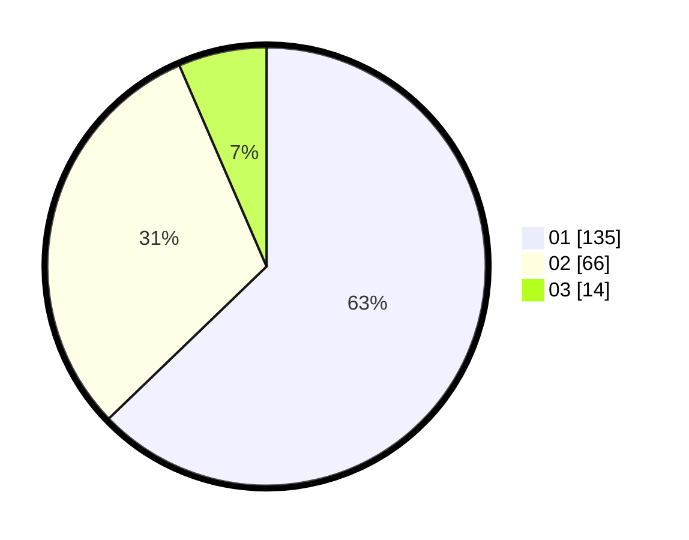

# Hasil

Hasil perolehan suara paslon dapat dilihat pada file paslon-01.txt, paslon-02.txt, dan paslon-03.txt.

Jika tidak ada, artinya data tersebut belum ada pada SIREKAP.

## Perolehan Suara

 * Paslon 01: **135**.
 * Paslon 02: **66**.
 * Paslon 03: **14**.

## Foto C Plano

https://sirekap-obj-formc.kpu.go.id/38e6/pemilu/ppwp/31/75/07/10/02/3175071002056-20240214-155507--2f02500a-5492-4b4e-b06b-3861101cd19a.jpg

https://sirekap-obj-formc.kpu.go.id/38e6/pemilu/ppwp/31/75/07/10/02/3175071002056-20240214-195407--ee1be3b3-a650-401e-8a6a-49391e755f38.jpg

https://sirekap-obj-formc.kpu.go.id/38e6/pemilu/ppwp/31/75/07/10/02/3175071002056-20240214-195737--b42bfdd9-d064-4c4b-ade0-761cc2dfbab9.jpg

## DATA PEMILIH TETAP

Jumlah pemilih dalam DPT: **216**.
 * L: **112**.
 * P: **104**.

## DATA PENGGUNA HAK PILIH

Jumlah pengguna hak pilih dalam DPT: **264**.
 * L: **140**.
 * P: **124**.

Jumlah pengguna hak pilih dalam DPTb: **2**.
 * L: **1**.
 * P: **1**.

Jumlah pengguna hak pilih dalam DPK: **2**.
 * L: **1**.
 * P: **1**.

Jumlah pengguna hak pilih: **268**.
 * L: **142**.
 * P: **126**.

## JUMLAH SUARA SAH DAN TIDAK SAH

JUMLAH SELURUH SUARA SAH: **215**.

JUMLAH SUARA TIDAK SAH: **1**.

JUMLAH SELURUH SUARA SAH DAN SUARA TIDAK SAH: **216**.
