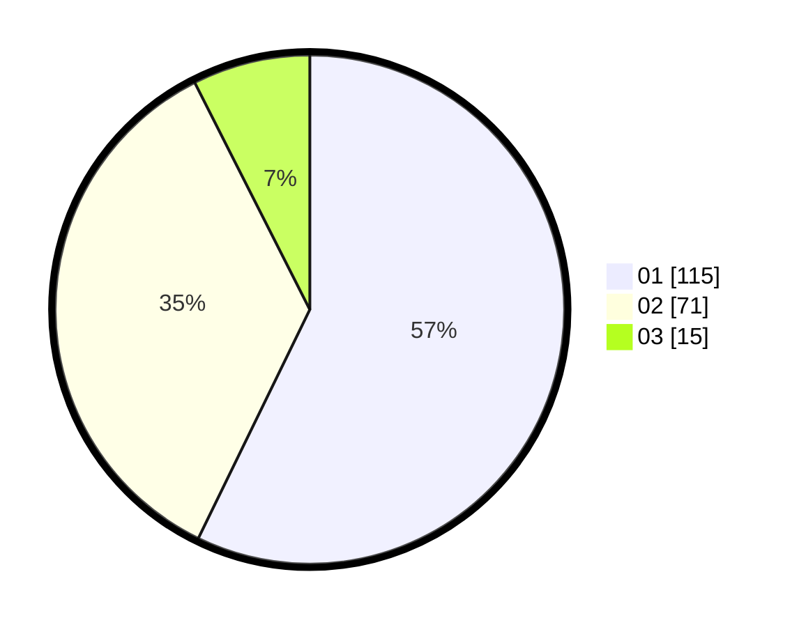

# Hasil

Hasil perolehan suara paslon dapat dilihat pada file paslon-01.txt, paslon-02.txt, dan paslon-03.txt.

Jika tidak ada, artinya data tersebut belum ada pada SIREKAP.

## Perolehan Suara

 * Paslon 01: **115**.
 * Paslon 02: **71**.
 * Paslon 03: **15**.

## Foto C Plano

https://sirekap-obj-formc.kpu.go.id/45dd/pemilu/ppwp/31/75/07/10/02/3175071002057-20240214-232230--0a9fa17c-7499-4075-9d8a-8a8455cbf1de.jpg

https://sirekap-obj-formc.kpu.go.id/45dd/pemilu/ppwp/31/75/07/10/02/3175071002057-20240214-232124--8c2d5d5c-a5c1-4472-856f-ff9625cd42dc.jpg

https://sirekap-obj-formc.kpu.go.id/45dd/pemilu/ppwp/31/75/07/10/02/3175071002057-20240214-232420--19df61e3-d114-47e3-a728-295c6b452bf3.jpg

## DATA PEMILIH TETAP

Jumlah pemilih dalam DPT: **262**.
 * L: **131**.
 * P: **131**.

## DATA PENGGUNA HAK PILIH

Jumlah pengguna hak pilih dalam DPT: **202**.
 * L: **97**.
 * P: **105**.

Jumlah pengguna hak pilih dalam DPTb: **2**.
 * L: **2**.
 * P: **0**.

Jumlah pengguna hak pilih dalam DPK: **2**.
 * L: **0**.
 * P: **2**.

Jumlah pengguna hak pilih: **206**.
 * L: **99**.
 * P: **107**.

## JUMLAH SUARA SAH DAN TIDAK SAH

JUMLAH SELURUH SUARA SAH: **201**.

JUMLAH SUARA TIDAK SAH: **5**.

JUMLAH SELURUH SUARA SAH DAN SUARA TIDAK SAH: **206**.
