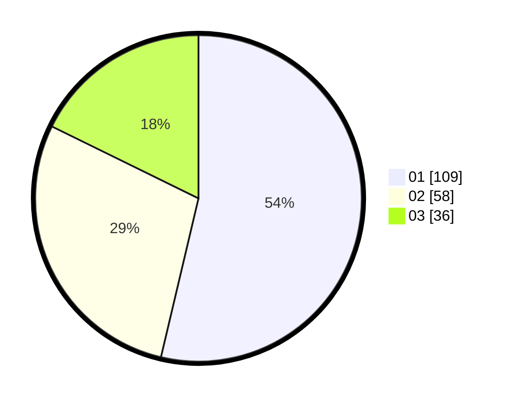

# Hasil

Hasil perolehan suara paslon dapat dilihat pada file paslon-01.txt, paslon-02.txt, dan paslon-03.txt.

Jika tidak ada, artinya data tersebut belum ada pada SIREKAP.

## Perolehan Suara

 * Paslon 01: **109**.
 * Paslon 02: **58**.
 * Paslon 03: **36**.

## Foto C Plano

https://sirekap-obj-formc.kpu.go.id/f8ee/pemilu/ppwp/31/75/07/10/02/3175071002068-20240214-191102--b8bfb03d-bd3f-4e97-b5de-c8c3665bd6ce.jpg

https://sirekap-obj-formc.kpu.go.id/f8ee/pemilu/ppwp/31/75/07/10/02/3175071002068-20240214-191115--31bc2696-d23e-4eff-be15-28313e9434cf.jpg

https://sirekap-obj-formc.kpu.go.id/f8ee/pemilu/ppwp/31/75/07/10/02/3175071002068-20240214-191121--5bd4a342-2bae-4c2f-b4c0-f1af1129aad4.jpg

## DATA PEMILIH TETAP

Jumlah pemilih dalam DPT: **277**.
 * L: **738**.
 * P: **739**.

## DATA PENGGUNA HAK PILIH

Jumlah pengguna hak pilih dalam DPT: **202**.
 * L: **47**.
 * P: **704**.

Jumlah pengguna hak pilih dalam DPTb: **5**.
 * L: **4**.
 * P: **7**.

Jumlah pengguna hak pilih dalam DPK: **0**.
 * L: **0**.
 * P: **0**.

Jumlah pengguna hak pilih: **206**.
 * L: **707**.
 * P: **705**.

## JUMLAH SUARA SAH DAN TIDAK SAH

JUMLAH SELURUH SUARA SAH: **203**.

JUMLAH SUARA TIDAK SAH: **3**.

JUMLAH SELURUH SUARA SAH DAN SUARA TIDAK SAH: **206**.
