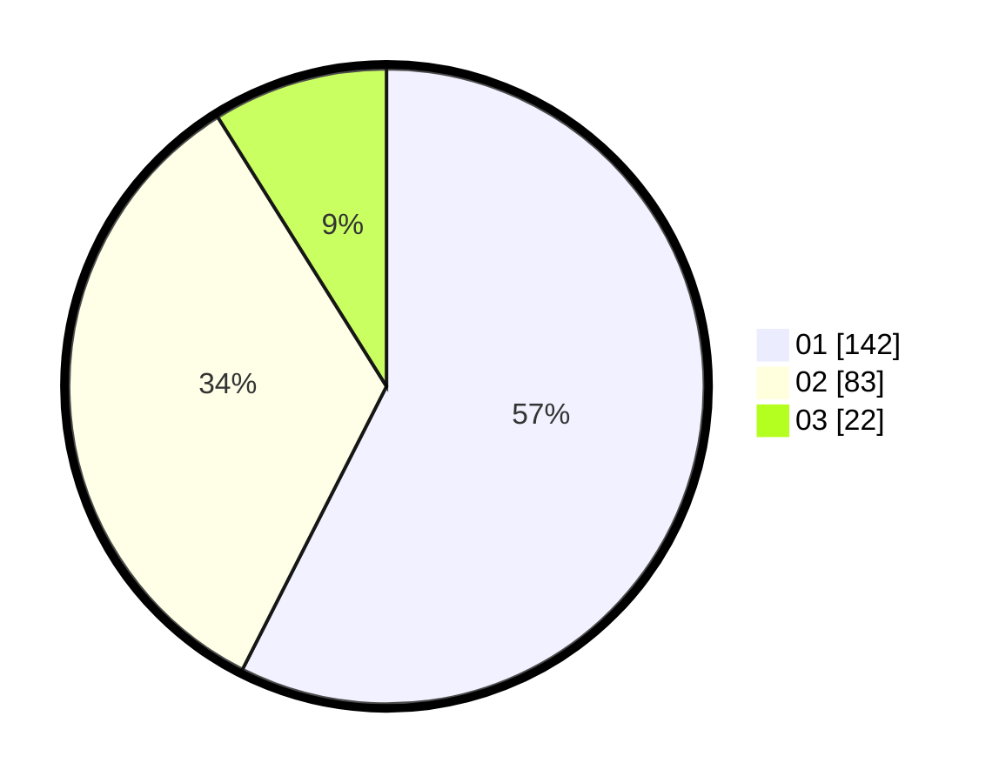

# Hasil

Hasil perolehan suara paslon dapat dilihat pada file paslon-01.txt, paslon-02.txt, dan paslon-03.txt.

Jika tidak ada, artinya data tersebut belum ada pada SIREKAP.

## Perolehan Suara

 * Paslon 01: **142**.
 * Paslon 02: **83**.
 * Paslon 03: **22**.

## Foto C Plano

https://sirekap-obj-formc.kpu.go.id/8ff3/pemilu/ppwp/31/75/07/10/02/3175071002072-20240214-235732--14bbd5e7-a2ff-4558-95ab-e310c25de0de.jpg

https://sirekap-obj-formc.kpu.go.id/8ff3/pemilu/ppwp/31/75/07/10/02/3175071002072-20240214-235829--9907aff3-0863-4e1a-8402-586a90538cab.jpg

https://sirekap-obj-formc.kpu.go.id/8ff3/pemilu/ppwp/31/75/07/10/02/3175071002072-20240214-235933--13f43474-2c0c-4c42-be4c-1e54a566caeb.jpg
