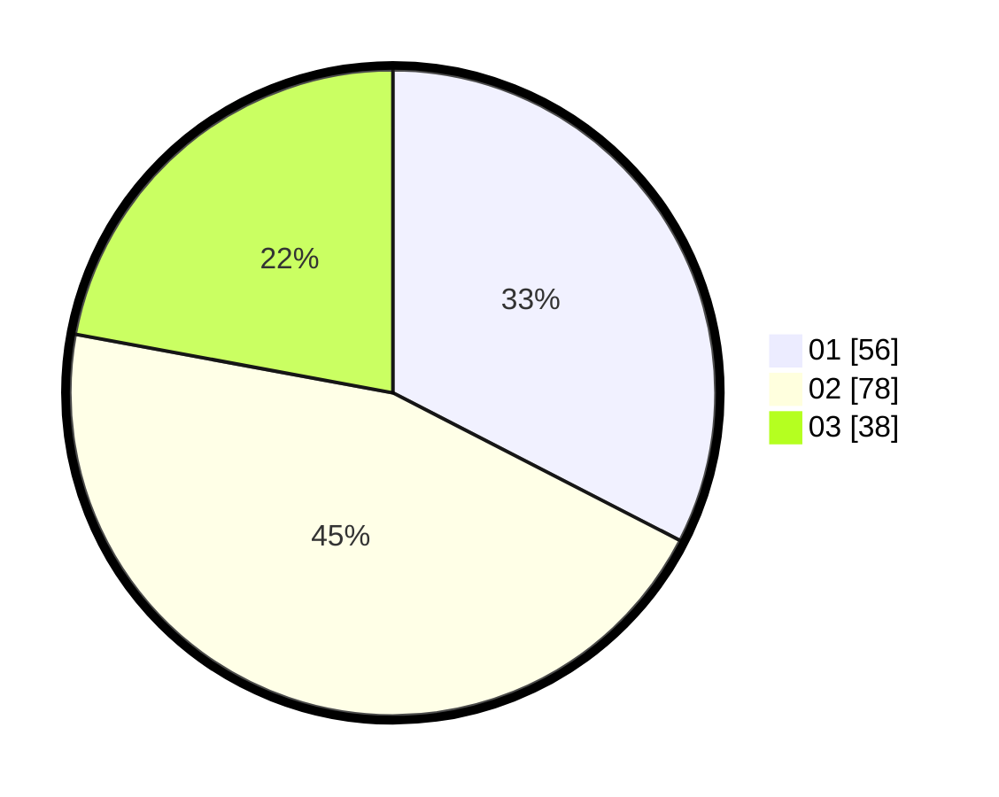

# Hasil

Hasil perolehan suara paslon dapat dilihat pada file paslon-01.txt, paslon-02.txt, dan paslon-03.txt.

Jika tidak ada, artinya data tersebut belum ada pada SIREKAP.

## Perolehan Suara

 * Paslon 01: **56**.
 * Paslon 02: **78**.
 * Paslon 03: **38**.

## Foto C Plano

https://sirekap-obj-formc.kpu.go.id/9850/pemilu/ppwp/31/75/07/10/02/3175071002074-20240214-221054--02e5489f-81d4-4ed0-840e-0692aa44b018.jpg

https://sirekap-obj-formc.kpu.go.id/9850/pemilu/ppwp/31/75/07/10/02/3175071002074-20240214-221138--818d56ac-985a-4b9f-bbed-3d4f7dc5565a.jpg

https://sirekap-obj-formc.kpu.go.id/9850/pemilu/ppwp/31/75/07/10/02/3175071002074-20240214-221216--90e204d5-f467-40eb-91c9-f40c20623bbc.jpg
