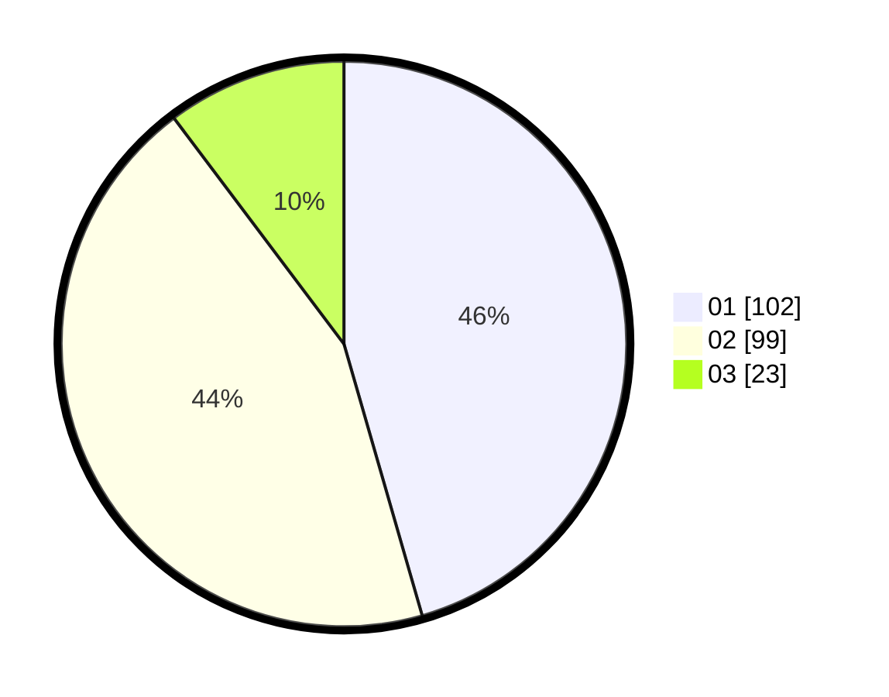

# Hasil

Hasil perolehan suara paslon dapat dilihat pada file paslon-01.txt, paslon-02.txt, dan paslon-03.txt.

Jika tidak ada, artinya data tersebut belum ada pada SIREKAP.

## Perolehan Suara

 * Paslon 01: **102**.
 * Paslon 02: **99**.
 * Paslon 03: **23**.

## Foto C Plano

https://sirekap-obj-formc.kpu.go.id/0847/pemilu/ppwp/31/75/07/10/02/3175071002078-20240214-191959--f9f4e8ce-65fe-4cf6-a06f-46c55ff618ad.jpg

https://sirekap-obj-formc.kpu.go.id/0847/pemilu/ppwp/31/75/07/10/02/3175071002078-20240214-192019--27aa1f34-608f-4ad6-aba1-ffa7d646aadc.jpg

https://sirekap-obj-formc.kpu.go.id/0847/pemilu/ppwp/31/75/07/10/02/3175071002078-20240214-211753--745f0dc1-0e74-4c6b-8288-fd6fbda30354.jpg

## DATA PEMILIH TETAP

Jumlah pemilih dalam DPT: **280**.
 * L: **146**.
 * P: **134**.

## DATA PENGGUNA HAK PILIH

Jumlah pengguna hak pilih dalam DPT: **221**.
 * L: **113**.
 * P: **108**.

Jumlah pengguna hak pilih dalam DPTb: **3**.
 * L: **1**.
 * P: **2**.

Jumlah pengguna hak pilih dalam DPK: **3**.
 * L: **1**.
 * P: **2**.

Jumlah pengguna hak pilih: **227**.
 * L: **115**.
 * P: **112**.

## JUMLAH SUARA SAH DAN TIDAK SAH

JUMLAH SELURUH SUARA SAH: **224**.

JUMLAH SUARA TIDAK SAH: **3**.

JUMLAH SELURUH SUARA SAH DAN SUARA TIDAK SAH: **227**.
