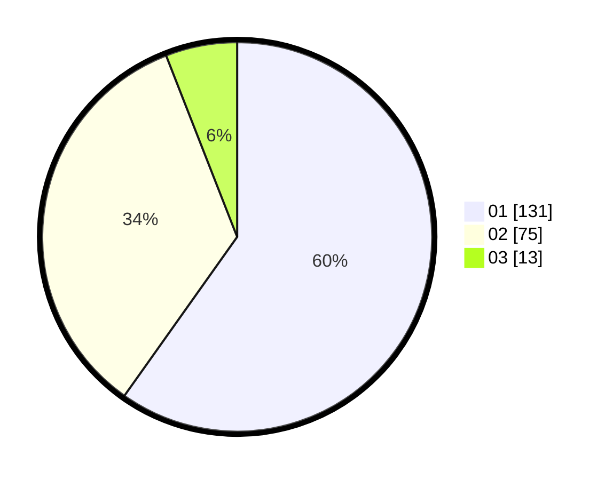

# Hasil

Hasil perolehan suara paslon dapat dilihat pada file paslon-01.txt, paslon-02.txt, dan paslon-03.txt.

Jika tidak ada, artinya data tersebut belum ada pada SIREKAP.

## Perolehan Suara

 * Paslon 01: **131**.
 * Paslon 02: **75**.
 * Paslon 03: **13**.

## Foto C Plano

https://sirekap-obj-formc.kpu.go.id/ee6e/pemilu/ppwp/31/75/07/10/02/3175071002080-20240215-220530--3c68b210-2818-428e-8123-d3df4ec23fa3.jpg

https://sirekap-obj-formc.kpu.go.id/ee6e/pemilu/ppwp/31/75/07/10/02/3175071002080-20240215-220605--3be8eb26-a7cc-49ff-b89b-6db45fc739ee.jpg

https://sirekap-obj-formc.kpu.go.id/ee6e/pemilu/ppwp/31/75/07/10/02/3175071002080-20240215-220619--fd958088-8aee-411c-9eb7-cb076d7c13ce.jpg
