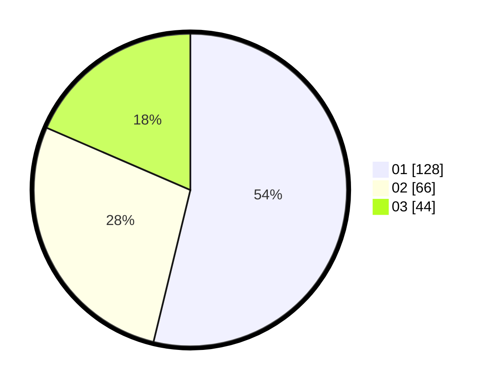

# Hasil

Hasil perolehan suara paslon dapat dilihat pada file paslon-01.txt, paslon-02.txt, dan paslon-03.txt.

Jika tidak ada, artinya data tersebut belum ada pada SIREKAP.

## Perolehan Suara

 * Paslon 01: **128**.
 * Paslon 02: **66**.
 * Paslon 03: **44**.

## Foto C Plano

https://sirekap-obj-formc.kpu.go.id/ea45/pemilu/ppwp/31/75/07/10/02/3175071002081-20240216-073307--44ad862f-126d-475d-b4a3-d60ec303f03b.jpg

https://sirekap-obj-formc.kpu.go.id/ea45/pemilu/ppwp/31/75/07/10/02/3175071002081-20240216-073342--6db00a4a-707d-46c7-a815-b36707b157cb.jpg

https://sirekap-obj-formc.kpu.go.id/ea45/pemilu/ppwp/31/75/07/10/02/3175071002081-20240216-073402--edd16002-ff70-4e2f-ad01-b6f33ec22121.jpg

## DATA PEMILIH TETAP

Jumlah pemilih dalam DPT: **294**.
 * L: **162**.
 * P: **132**.

## DATA PENGGUNA HAK PILIH

Jumlah pengguna hak pilih dalam DPT: **240**.
 * L: **128**.
 * P: **112**.

Jumlah pengguna hak pilih dalam DPTb: **0**.
 * L: **0**.
 * P: **0**.

Jumlah pengguna hak pilih dalam DPK: **1**.
 * L: **0**.
 * P: **1**.

Jumlah pengguna hak pilih: **241**.
 * L: **128**.
 * P: **113**.

## JUMLAH SUARA SAH DAN TIDAK SAH

JUMLAH SELURUH SUARA SAH: **238**.

JUMLAH SUARA TIDAK SAH: **3**.

JUMLAH SELURUH SUARA SAH DAN SUARA TIDAK SAH: **241**.
