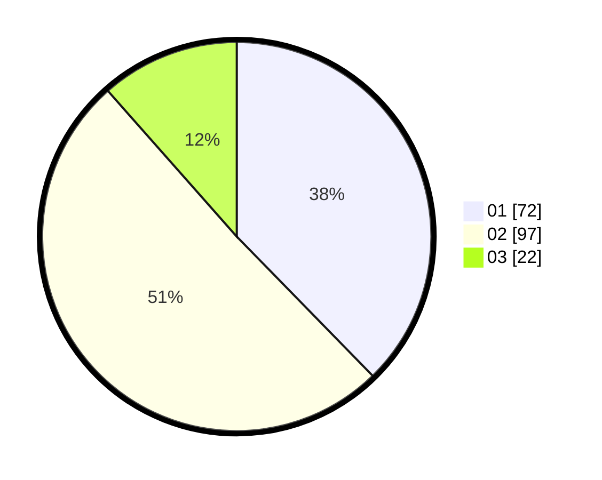

# Hasil

Hasil perolehan suara paslon dapat dilihat pada file paslon-01.txt, paslon-02.txt, dan paslon-03.txt.

Jika tidak ada, artinya data tersebut belum ada pada SIREKAP.

## Perolehan Suara

 * Paslon 01: **72**.
 * Paslon 02: **97**.
 * Paslon 03: **22**.

## Foto C Plano

https://sirekap-obj-formc.kpu.go.id/ab36/pemilu/ppwp/31/75/07/10/02/3175071002082-20240214-190249--6d749840-ee8a-4958-b5ab-070018f29d27.jpg

https://sirekap-obj-formc.kpu.go.id/ab36/pemilu/ppwp/31/75/07/10/02/3175071002082-20240214-190421--628cf244-b7e3-43a4-a279-39bb8a44c821.jpg

https://sirekap-obj-formc.kpu.go.id/ab36/pemilu/ppwp/31/75/07/10/02/3175071002082-20240214-190542--5651c63f-15e6-4840-ab9d-5a4d3adf60ae.jpg

## DATA PEMILIH TETAP

Jumlah pemilih dalam DPT: **259**.
 * L: **130**.
 * P: **129**.

## DATA PENGGUNA HAK PILIH

Jumlah pengguna hak pilih dalam DPT: **186**.
 * L: **94**.
 * P: **92**.

Jumlah pengguna hak pilih dalam DPTb: **0**.
 * L: **0**.
 * P: **0**.

Jumlah pengguna hak pilih dalam DPK: **5**.
 * L: **2**.
 * P: **3**.

Jumlah pengguna hak pilih: **191**.
 * L: **96**.
 * P: **95**.

## JUMLAH SUARA SAH DAN TIDAK SAH

JUMLAH SELURUH SUARA SAH: **191**.

JUMLAH SUARA TIDAK SAH: **0**.

JUMLAH SELURUH SUARA SAH DAN SUARA TIDAK SAH: **191**.
