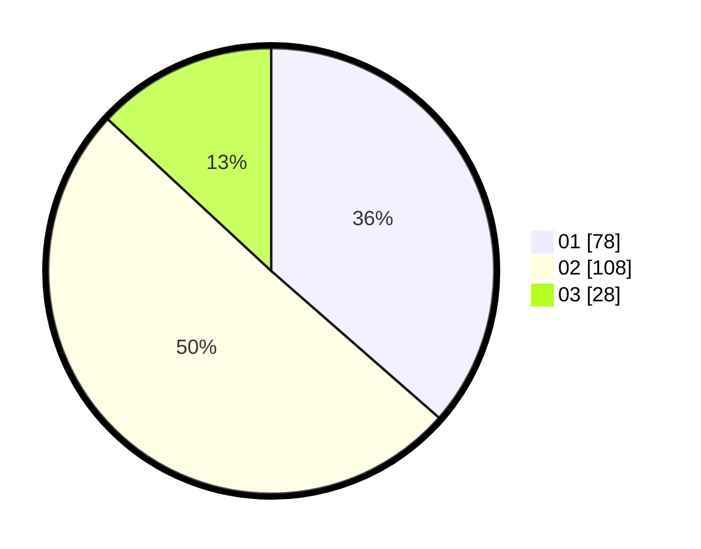

# Hasil

Hasil perolehan suara paslon dapat dilihat pada file paslon-01.txt, paslon-02.txt, dan paslon-03.txt.

Jika tidak ada, artinya data tersebut belum ada pada SIREKAP.

## Perolehan Suara

 * Paslon 01: **78**.
 * Paslon 02: **108**.
 * Paslon 03: **28**.

## Foto C Plano

https://sirekap-obj-formc.kpu.go.id/7f12/pemilu/ppwp/31/75/07/10/02/3175071002089-20240214-193151--2bf00559-9c78-45a7-97c4-31b10c71c206.jpg

https://sirekap-obj-formc.kpu.go.id/7f12/pemilu/ppwp/31/75/07/10/02/3175071002089-20240214-193422--93014342-393b-4fb8-93ac-f24fd13f0222.jpg

https://sirekap-obj-formc.kpu.go.id/7f12/pemilu/ppwp/31/75/07/10/02/3175071002089-20240214-193449--5a841045-078e-4eea-8192-3205aca81c06.jpg

## DATA PEMILIH TETAP

Jumlah pemilih dalam DPT: **275**.
 * L: **143**.
 * P: **132**.

## DATA PENGGUNA HAK PILIH

Jumlah pengguna hak pilih dalam DPT: **214**.
 * L: **105**.
 * P: **109**.

Jumlah pengguna hak pilih dalam DPTb: **0**.
 * L: **0**.
 * P: **0**.

Jumlah pengguna hak pilih dalam DPK: **3**.
 * L: **2**.
 * P: **1**.

Jumlah pengguna hak pilih: **217**.
 * L: **107**.
 * P: **110**.

## JUMLAH SUARA SAH DAN TIDAK SAH

JUMLAH SELURUH SUARA SAH: **214**.

JUMLAH SUARA TIDAK SAH: **3**.

JUMLAH SELURUH SUARA SAH DAN SUARA TIDAK SAH: **217**.
