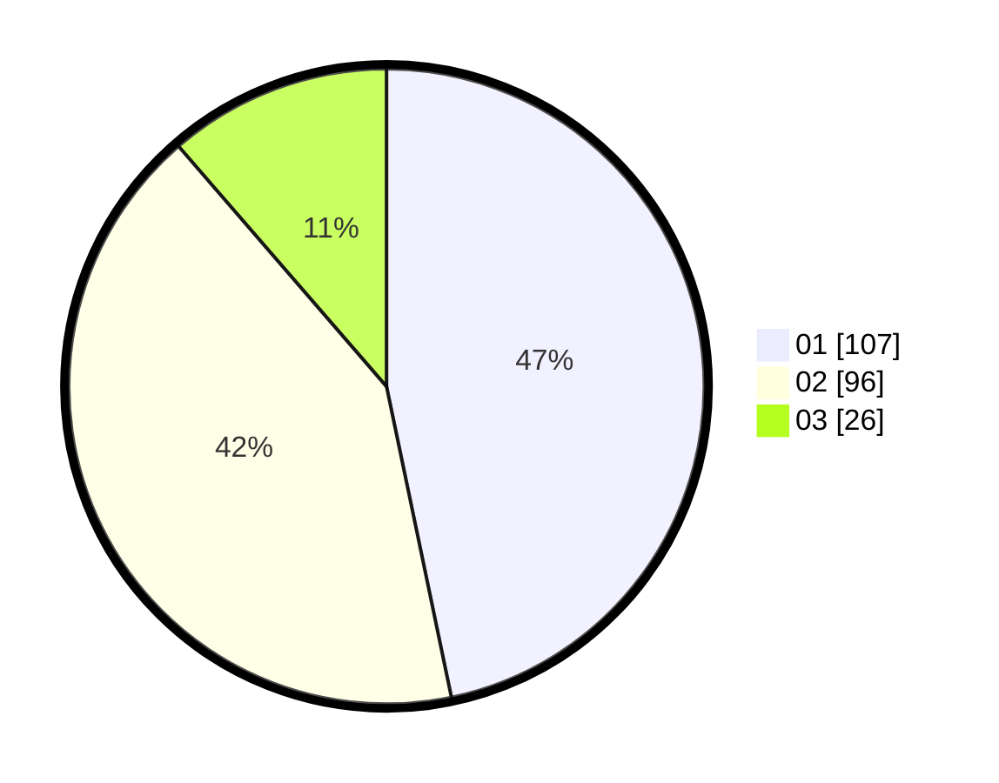

# Hasil

Hasil perolehan suara paslon dapat dilihat pada file paslon-01.txt, paslon-02.txt, dan paslon-03.txt.

Jika tidak ada, artinya data tersebut belum ada pada SIREKAP.

## Perolehan Suara

 * Paslon 01: **107**.
 * Paslon 02: **96**.
 * Paslon 03: **26**.

## Foto C Plano

https://sirekap-obj-formc.kpu.go.id/7170/pemilu/ppwp/31/75/07/10/02/3175071002090-20240214-155812--02554a4a-1bc5-4b34-9347-c32c5faa7eab.jpg

https://sirekap-obj-formc.kpu.go.id/7170/pemilu/ppwp/31/75/07/10/02/3175071002090-20240214-223720--e2b5997e-2a03-4f64-9659-8b612403676c.jpg

https://sirekap-obj-formc.kpu.go.id/7170/pemilu/ppwp/31/75/07/10/02/3175071002090-20240214-223827--3b70df87-bd73-4d12-88bd-fe5fd3268e2d.jpg

## DATA PEMILIH TETAP

Jumlah pemilih dalam DPT: **287**.
 * L: **146**.
 * P: **141**.

## DATA PENGGUNA HAK PILIH

Jumlah pengguna hak pilih dalam DPT: **232**.
 * L: **112**.
 * P: **120**.

Jumlah pengguna hak pilih dalam DPTb: **1**.
 * L: **1**.
 * P: **0**.

Jumlah pengguna hak pilih dalam DPK: **1**.
 * L: **0**.
 * P: **1**.

Jumlah pengguna hak pilih: **234**.
 * L: **113**.
 * P: **121**.

## JUMLAH SUARA SAH DAN TIDAK SAH

JUMLAH SELURUH SUARA SAH: **229**.

JUMLAH SUARA TIDAK SAH: **5**.

JUMLAH SELURUH SUARA SAH DAN SUARA TIDAK SAH: **234**.
