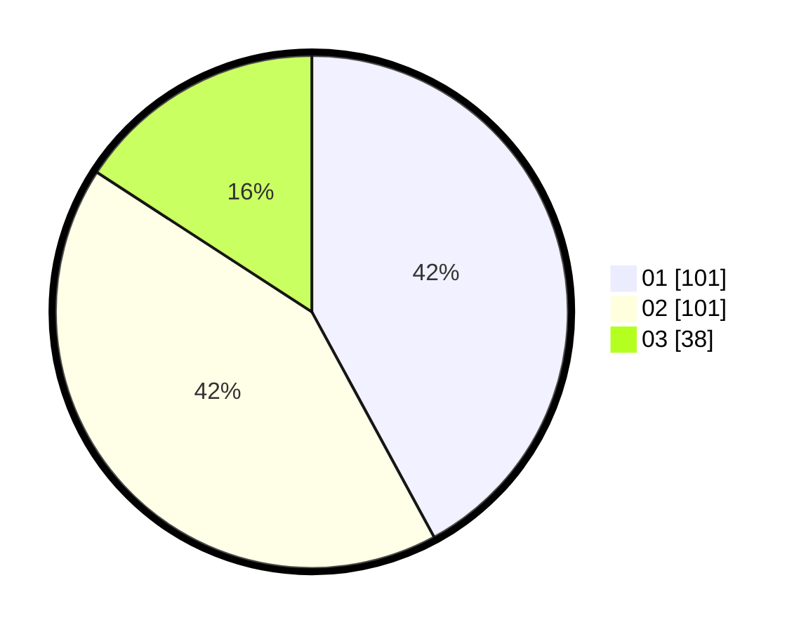

# Hasil

Hasil perolehan suara paslon dapat dilihat pada file paslon-01.txt, paslon-02.txt, dan paslon-03.txt.

Jika tidak ada, artinya data tersebut belum ada pada SIREKAP.

## Perolehan Suara

 * Paslon 01: **101**.
 * Paslon 02: **101**.
 * Paslon 03: **38**.

## Foto C Plano

https://sirekap-obj-formc.kpu.go.id/3e9f/pemilu/ppwp/31/75/07/10/02/3175071002093-20240215-051912--14e59114-9045-48be-b437-000593b1145e.jpg

https://sirekap-obj-formc.kpu.go.id/3e9f/pemilu/ppwp/31/75/07/10/02/3175071002093-20240215-052043--1407715d-3a1f-4057-bd1b-846fc2f4b6a1.jpg
