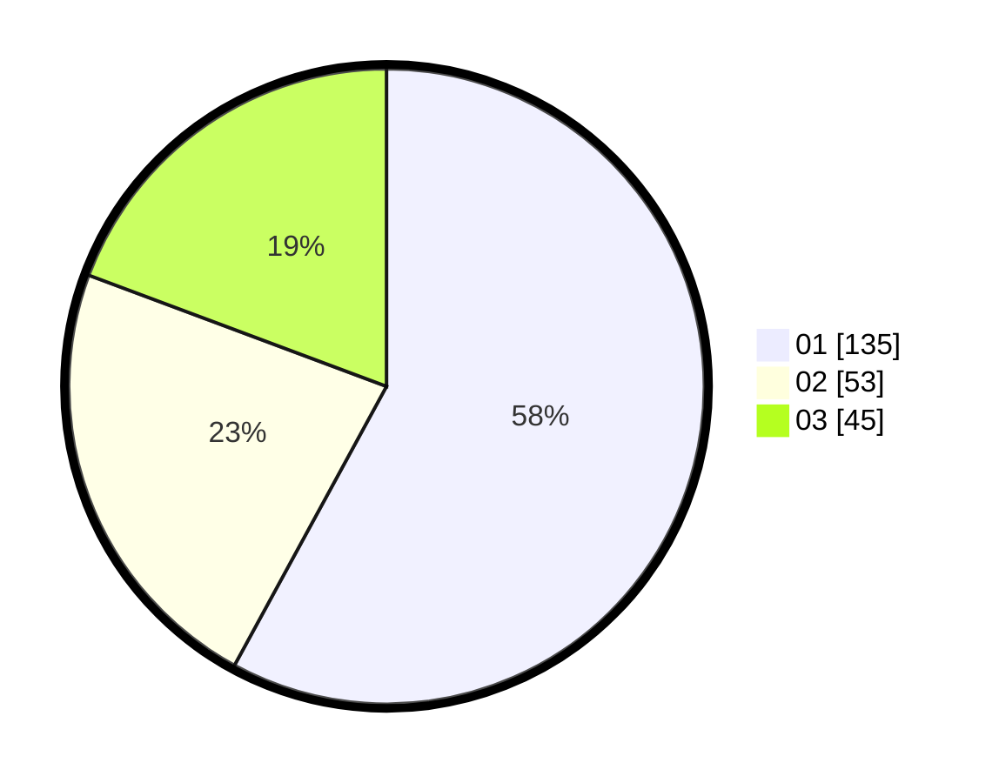

# Hasil

Hasil perolehan suara paslon dapat dilihat pada file paslon-01.txt, paslon-02.txt, dan paslon-03.txt.

Jika tidak ada, artinya data tersebut belum ada pada SIREKAP.

## Perolehan Suara

 * Paslon 01: **135**.
 * Paslon 02: **53**.
 * Paslon 03: **45**.

## Foto C Plano

https://sirekap-obj-formc.kpu.go.id/95c3/pemilu/ppwp/31/75/07/10/02/3175071002095-20240214-190710--8f809ecf-37ed-4a13-94f9-57f5412101c4.jpg

https://sirekap-obj-formc.kpu.go.id/95c3/pemilu/ppwp/31/75/07/10/02/3175071002095-20240214-191011--29b21f59-1c4f-4d85-b005-3ab3bd0adbca.jpg

https://sirekap-obj-formc.kpu.go.id/95c3/pemilu/ppwp/31/75/07/10/02/3175071002095-20240214-191717--f4a755bc-2bf3-4dd8-83d1-3f1e63df76d6.jpg

## DATA PEMILIH TETAP

Jumlah pemilih dalam DPT: **276**.
 * L: **138**.
 * P: **138**.

## DATA PENGGUNA HAK PILIH

Jumlah pengguna hak pilih dalam DPT: **226**.
 * L: **111**.
 * P: **115**.

Jumlah pengguna hak pilih dalam DPTb: **1**.
 * L: **0**.
 * P: **1**.

Jumlah pengguna hak pilih dalam DPK: **10**.
 * L: **3**.
 * P: **7**.

Jumlah pengguna hak pilih: **237**.
 * L: **114**.
 * P: **123**.

## JUMLAH SUARA SAH DAN TIDAK SAH

JUMLAH SELURUH SUARA SAH: **233**.

JUMLAH SUARA TIDAK SAH: **4**.

JUMLAH SELURUH SUARA SAH DAN SUARA TIDAK SAH: **237**.
