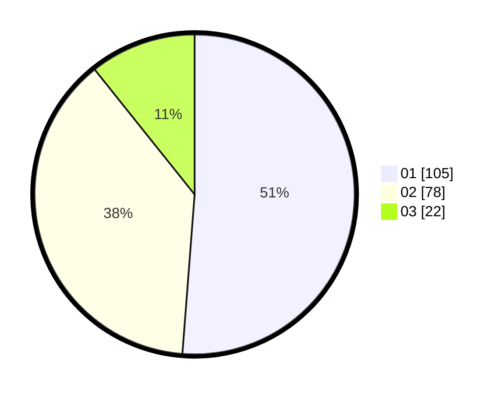

# Hasil

Hasil perolehan suara paslon dapat dilihat pada file paslon-01.txt, paslon-02.txt, dan paslon-03.txt.

Jika tidak ada, artinya data tersebut belum ada pada SIREKAP.

## Perolehan Suara

 * Paslon 01: **105**.
 * Paslon 02: **78**.
 * Paslon 03: **22**.

## Foto C Plano

https://sirekap-obj-formc.kpu.go.id/389b/pemilu/ppwp/31/75/07/10/02/3175071002096-20240216-051723--bcd84383-f89d-4d2a-8f6c-087c11258230.jpg

https://sirekap-obj-formc.kpu.go.id/389b/pemilu/ppwp/31/75/07/10/02/3175071002096-20240216-051725--4c493963-5737-452b-b303-8e3f2f691950.jpg

https://sirekap-obj-formc.kpu.go.id/389b/pemilu/ppwp/31/75/07/10/02/3175071002096-20240216-051724--cc2c8e5e-4088-4c45-841f-35f4ffddcfa2.jpg

## DATA PEMILIH TETAP

Jumlah pemilih dalam DPT: **0**.
 * L: **0**.
 * P: **0**.

## DATA PENGGUNA HAK PILIH

Jumlah pengguna hak pilih dalam DPT: **0**.
 * L: **0**.
 * P: **0**.

Jumlah pengguna hak pilih dalam DPTb: **0**.
 * L: **0**.
 * P: **0**.

Jumlah pengguna hak pilih dalam DPK: **0**.
 * L: **0**.
 * P: **0**.

Jumlah pengguna hak pilih: **0**.
 * L: **0**.
 * P: **0**.

## JUMLAH SUARA SAH DAN TIDAK SAH

JUMLAH SELURUH SUARA SAH: **203**.

JUMLAH SUARA TIDAK SAH: **2**.

JUMLAH SELURUH SUARA SAH DAN SUARA TIDAK SAH: **205**.
