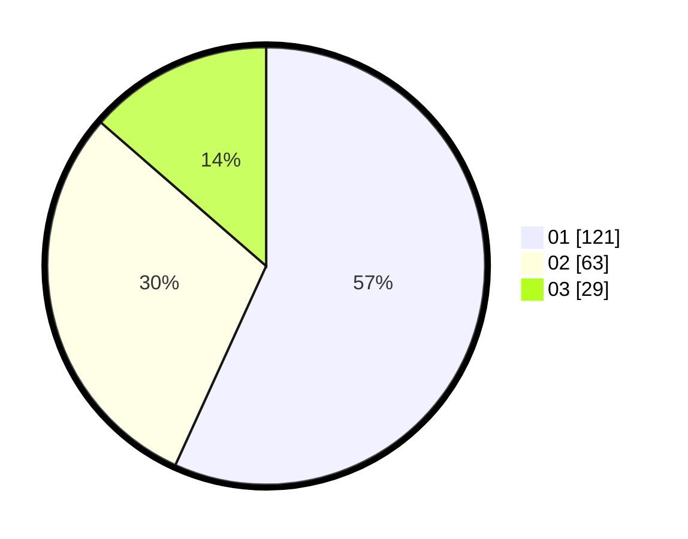

# Hasil

Hasil perolehan suara paslon dapat dilihat pada file paslon-01.txt, paslon-02.txt, dan paslon-03.txt.

Jika tidak ada, artinya data tersebut belum ada pada SIREKAP.

## Perolehan Suara

 * Paslon 01: **121**.
 * Paslon 02: **63**.
 * Paslon 03: **29**.

## Foto C Plano

https://sirekap-obj-formc.kpu.go.id/b285/pemilu/ppwp/31/75/07/10/02/3175071002097-20240216-164338--a4c04399-4125-4790-aaf7-6c2f08808495.jpg

https://sirekap-obj-formc.kpu.go.id/b285/pemilu/ppwp/31/75/07/10/02/3175071002097-20240216-164339--98752f50-26c7-4ca8-b3fc-ead87513c744.jpg

https://sirekap-obj-formc.kpu.go.id/b285/pemilu/ppwp/31/75/07/10/02/3175071002097-20240216-164339--885d7a0c-f666-4f0a-8da2-649c47e04918.jpg

## DATA PEMILIH TETAP

Jumlah pemilih dalam DPT: **260**.
 * L: **120**.
 * P: **140**.

## DATA PENGGUNA HAK PILIH

Jumlah pengguna hak pilih dalam DPT: **209**.
 * L: **94**.
 * P: **115**.

Jumlah pengguna hak pilih dalam DPTb: **7**.
 * L: **3**.
 * P: **4**.

Jumlah pengguna hak pilih dalam DPK: **2**.
 * L: **1**.
 * P: **1**.

Jumlah pengguna hak pilih: **218**.
 * L: **98**.
 * P: **120**.

## JUMLAH SUARA SAH DAN TIDAK SAH

JUMLAH SELURUH SUARA SAH: **213**.

JUMLAH SUARA TIDAK SAH: **5**.

JUMLAH SELURUH SUARA SAH DAN SUARA TIDAK SAH: **218**.
