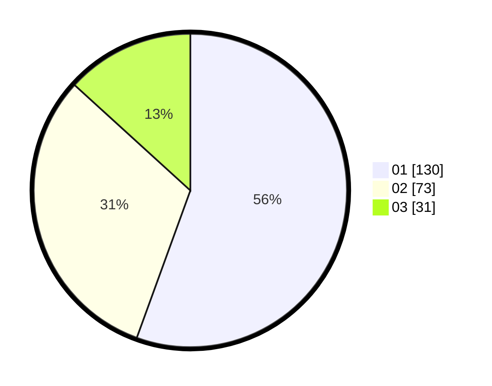

# Hasil

Hasil perolehan suara paslon dapat dilihat pada file paslon-01.txt, paslon-02.txt, dan paslon-03.txt.

Jika tidak ada, artinya data tersebut belum ada pada SIREKAP.

## Perolehan Suara

 * Paslon 01: **130**.
 * Paslon 02: **73**.
 * Paslon 03: **31**.

## Foto C Plano

https://sirekap-obj-formc.kpu.go.id/fc6b/pemilu/ppwp/31/75/07/10/02/3175071002098-20240214-195722--7802c200-99d9-4084-abf0-8ae3c46731e5.jpg

https://sirekap-obj-formc.kpu.go.id/fc6b/pemilu/ppwp/31/75/07/10/02/3175071002098-20240214-194220--8990f3da-948f-4b9d-8e19-4c7c404877a7.jpg

https://sirekap-obj-formc.kpu.go.id/fc6b/pemilu/ppwp/31/75/07/10/02/3175071002098-20240214-194234--e622f9ca-c13b-47b1-9a43-4c6f6428a9a2.jpg

## DATA PEMILIH TETAP

Jumlah pemilih dalam DPT: **269**.
 * L: **125**.
 * P: **144**.

## DATA PENGGUNA HAK PILIH

Jumlah pengguna hak pilih dalam DPT: **219**.
 * L: **95**.
 * P: **124**.

Jumlah pengguna hak pilih dalam DPTb: **18**.
 * L: **6**.
 * P: **12**.

Jumlah pengguna hak pilih dalam DPK: **2**.
 * L: **2**.
 * P: **0**.

Jumlah pengguna hak pilih: **239**.
 * L: **103**.
 * P: **136**.

## JUMLAH SUARA SAH DAN TIDAK SAH

JUMLAH SELURUH SUARA SAH: **234**.

JUMLAH SUARA TIDAK SAH: **5**.

JUMLAH SELURUH SUARA SAH DAN SUARA TIDAK SAH: **239**.
