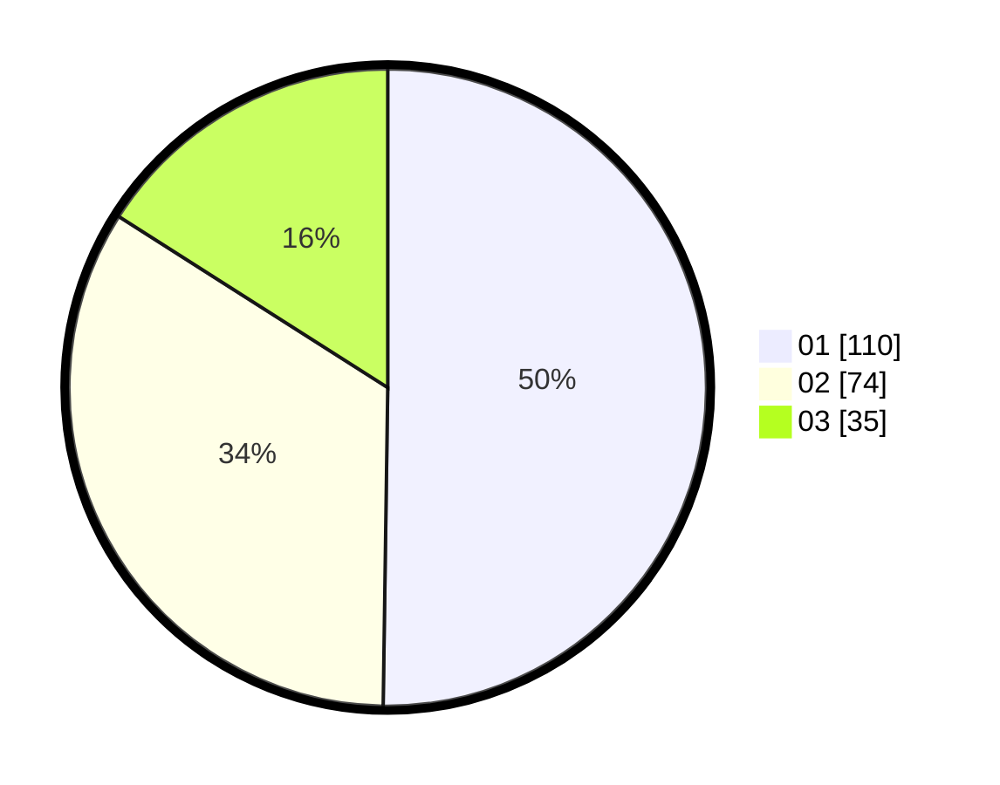

# Hasil

Hasil perolehan suara paslon dapat dilihat pada file paslon-01.txt, paslon-02.txt, dan paslon-03.txt.

Jika tidak ada, artinya data tersebut belum ada pada SIREKAP.

## Perolehan Suara

 * Paslon 01: **110**.
 * Paslon 02: **74**.
 * Paslon 03: **35**.

## Foto C Plano

https://sirekap-obj-formc.kpu.go.id/4745/pemilu/ppwp/31/75/07/10/02/3175071002099-20240214-211604--e7e9cfff-23f6-4a8b-809e-a65b7dac97fc.jpg

https://sirekap-obj-formc.kpu.go.id/4745/pemilu/ppwp/31/75/07/10/02/3175071002099-20240214-211705--2455ee9f-ceff-4b09-be01-4e44cd63bc35.jpg

https://sirekap-obj-formc.kpu.go.id/4745/pemilu/ppwp/31/75/07/10/02/3175071002099-20240214-211948--538b6fc7-ce09-452d-b250-d92972193efd.jpg

## DATA PEMILIH TETAP

Jumlah pemilih dalam DPT: **259**.
 * L: **126**.
 * P: **133**.

## DATA PENGGUNA HAK PILIH

Jumlah pengguna hak pilih dalam DPT: **203**.
 * L: **102**.
 * P: **101**.

Jumlah pengguna hak pilih dalam DPTb: **19**.
 * L: **10**.
 * P: **9**.

Jumlah pengguna hak pilih dalam DPK: **0**.
 * L: **0**.
 * P: **0**.

Jumlah pengguna hak pilih: **222**.
 * L: **112**.
 * P: **110**.

## JUMLAH SUARA SAH DAN TIDAK SAH

JUMLAH SELURUH SUARA SAH: **219**.

JUMLAH SUARA TIDAK SAH: **3**.

JUMLAH SELURUH SUARA SAH DAN SUARA TIDAK SAH: **222**.
