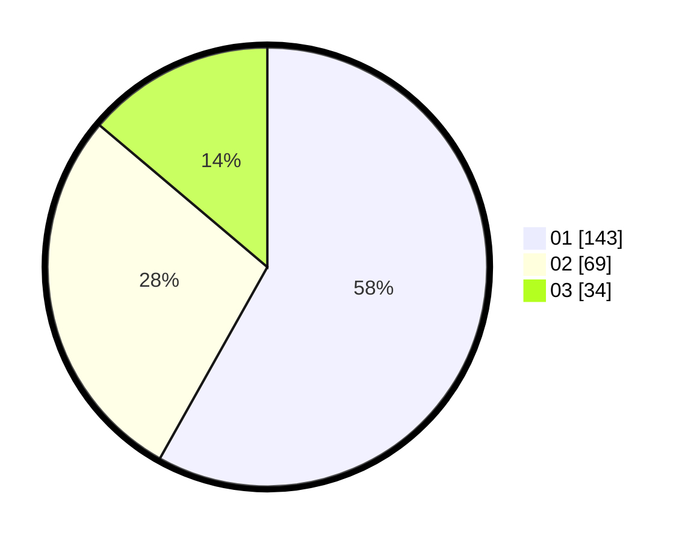

# Hasil

Hasil perolehan suara paslon dapat dilihat pada file paslon-01.txt, paslon-02.txt, dan paslon-03.txt.

Jika tidak ada, artinya data tersebut belum ada pada SIREKAP.

## Perolehan Suara

 * Paslon 01: **143**.
 * Paslon 02: **69**.
 * Paslon 03: **34**.

## Foto C Plano

https://sirekap-obj-formc.kpu.go.id/bf5c/pemilu/ppwp/31/75/07/10/02/3175071002102-20240214-155432--3ce8e110-b1a6-4ea3-90cf-2f24e4a749e5.jpg

https://sirekap-obj-formc.kpu.go.id/bf5c/pemilu/ppwp/31/75/07/10/02/3175071002102-20240214-155416--7ebd78f3-b9ac-4c9a-b036-bacdd0d1f1f1.jpg

https://sirekap-obj-formc.kpu.go.id/bf5c/pemilu/ppwp/31/75/07/10/02/3175071002102-20240215-030143--f47e206c-67f3-4a87-868e-bc873eef7dba.jpg

## DATA PEMILIH TETAP

Jumlah pemilih dalam DPT: **296**.
 * L: **145**.
 * P: **151**.

## DATA PENGGUNA HAK PILIH

Jumlah pengguna hak pilih dalam DPT: **217**.
 * L: **101**.
 * P: **116**.

Jumlah pengguna hak pilih dalam DPTb: **28**.
 * L: **15**.
 * P: **13**.

Jumlah pengguna hak pilih dalam DPK: **1**.
 * L: **0**.
 * P: **1**.

Jumlah pengguna hak pilih: **246**.
 * L: **116**.
 * P: **130**.

## JUMLAH SUARA SAH DAN TIDAK SAH

JUMLAH SELURUH SUARA SAH: **246**.

JUMLAH SUARA TIDAK SAH: **0**.

JUMLAH SELURUH SUARA SAH DAN SUARA TIDAK SAH: **246**.
