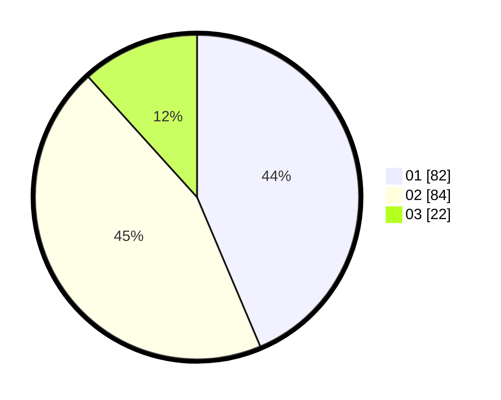

# Hasil

Hasil perolehan suara paslon dapat dilihat pada file paslon-01.txt, paslon-02.txt, dan paslon-03.txt.

Jika tidak ada, artinya data tersebut belum ada pada SIREKAP.

## Perolehan Suara

 * Paslon 01: **82**.
 * Paslon 02: **84**.
 * Paslon 03: **22**.

## Foto C Plano

https://sirekap-obj-formc.kpu.go.id/9809/pemilu/ppwp/31/75/07/10/02/3175071002103-20240214-184849--0b232dbc-331c-4ded-83a4-28c47aada0f5.jpg

https://sirekap-obj-formc.kpu.go.id/9809/pemilu/ppwp/31/75/07/10/02/3175071002103-20240214-184957--3b0eba26-21ab-4c85-8a37-8c6355425ca0.jpg

https://sirekap-obj-formc.kpu.go.id/9809/pemilu/ppwp/31/75/07/10/02/3175071002103-20240215-233433--2c0a8155-5f83-4db8-ab09-81e47ef3f9cc.jpg

## DATA PEMILIH TETAP

Jumlah pemilih dalam DPT: **191**.
 * L: **90**.
 * P: **101**.

## DATA PENGGUNA HAK PILIH

Jumlah pengguna hak pilih dalam DPT: **189**.
 * L: **89**.
 * P: **100**.

Jumlah pengguna hak pilih dalam DPTb: **1**.
 * L: **0**.
 * P: **1**.

Jumlah pengguna hak pilih dalam DPK: **1**.
 * L: **1**.
 * P: **0**.

Jumlah pengguna hak pilih: **191**.
 * L: **90**.
 * P: **101**.

## JUMLAH SUARA SAH DAN TIDAK SAH

JUMLAH SELURUH SUARA SAH: **188**.

JUMLAH SUARA TIDAK SAH: **3**.

JUMLAH SELURUH SUARA SAH DAN SUARA TIDAK SAH: **191**.
