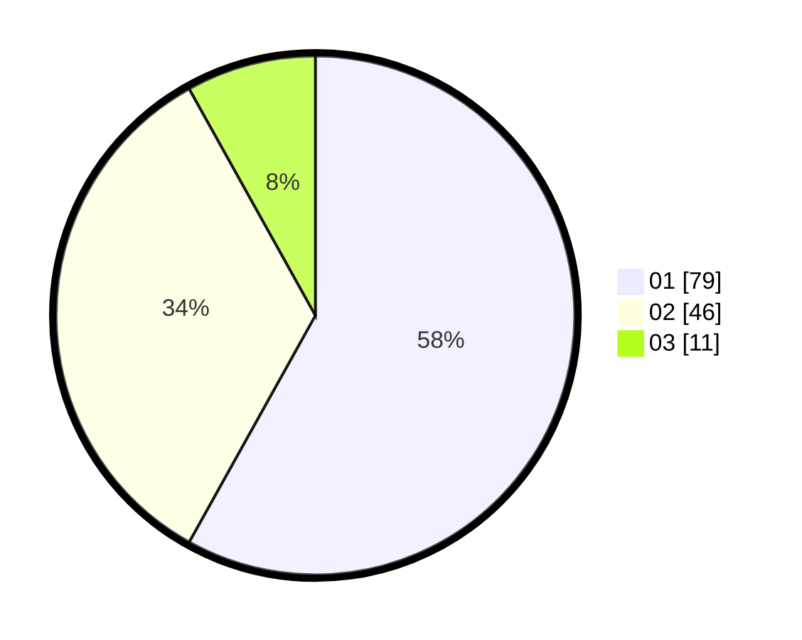

# Hasil

Hasil perolehan suara paslon dapat dilihat pada file paslon-01.txt, paslon-02.txt, dan paslon-03.txt.

Jika tidak ada, artinya data tersebut belum ada pada SIREKAP.

## Perolehan Suara

 * Paslon 01: **79**.
 * Paslon 02: **46**.
 * Paslon 03: **11**.

## Foto C Plano

https://sirekap-obj-formc.kpu.go.id/6a71/pemilu/ppwp/31/75/07/10/02/3175071002105-20240216-150216--0b5ad1bd-f65e-4709-9ed2-dbe2c65b9320.jpg

https://sirekap-obj-formc.kpu.go.id/6a71/pemilu/ppwp/31/75/07/10/02/3175071002105-20240216-150218--b4b69480-a621-4a38-a5a0-7dd04e68b941.jpg

https://sirekap-obj-formc.kpu.go.id/6a71/pemilu/ppwp/31/75/07/10/02/3175071002105-20240216-150217--e0a53181-6cc4-4139-b8cb-fd6a7f89b7ea.jpg

## DATA PEMILIH TETAP

Jumlah pemilih dalam DPT: **163**.
 * L: **74**.
 * P: **89**.

## DATA PENGGUNA HAK PILIH

Jumlah pengguna hak pilih dalam DPT: **138**.
 * L: **62**.
 * P: **76**.

Jumlah pengguna hak pilih dalam DPTb: **0**.
 * L: **0**.
 * P: **0**.

Jumlah pengguna hak pilih dalam DPK: **0**.
 * L: **0**.
 * P: **0**.

Jumlah pengguna hak pilih: **138**.
 * L: **62**.
 * P: **76**.

## JUMLAH SUARA SAH DAN TIDAK SAH

JUMLAH SELURUH SUARA SAH: **136**.

JUMLAH SUARA TIDAK SAH: **2**.

JUMLAH SELURUH SUARA SAH DAN SUARA TIDAK SAH: **138**.
