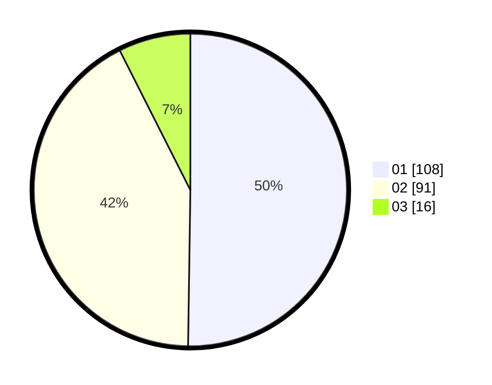

# Hasil

Hasil perolehan suara paslon dapat dilihat pada file paslon-01.txt, paslon-02.txt, dan paslon-03.txt.

Jika tidak ada, artinya data tersebut belum ada pada SIREKAP.

## Perolehan Suara

 * Paslon 01: **108**.
 * Paslon 02: **91**.
 * Paslon 03: **16**.

## Foto C Plano

https://sirekap-obj-formc.kpu.go.id/cb69/pemilu/ppwp/31/75/07/10/02/3175071002107-20240214-210029--17e7307a-4a20-48e5-a691-f00f5a3681e5.jpg

https://sirekap-obj-formc.kpu.go.id/cb69/pemilu/ppwp/31/75/07/10/02/3175071002107-20240214-210113--896d4ca9-beef-4112-993b-f65756673f40.jpg

https://sirekap-obj-formc.kpu.go.id/cb69/pemilu/ppwp/31/75/07/10/02/3175071002107-20240214-210153--c315d393-312c-4e34-b40d-368f6fe467c5.jpg
