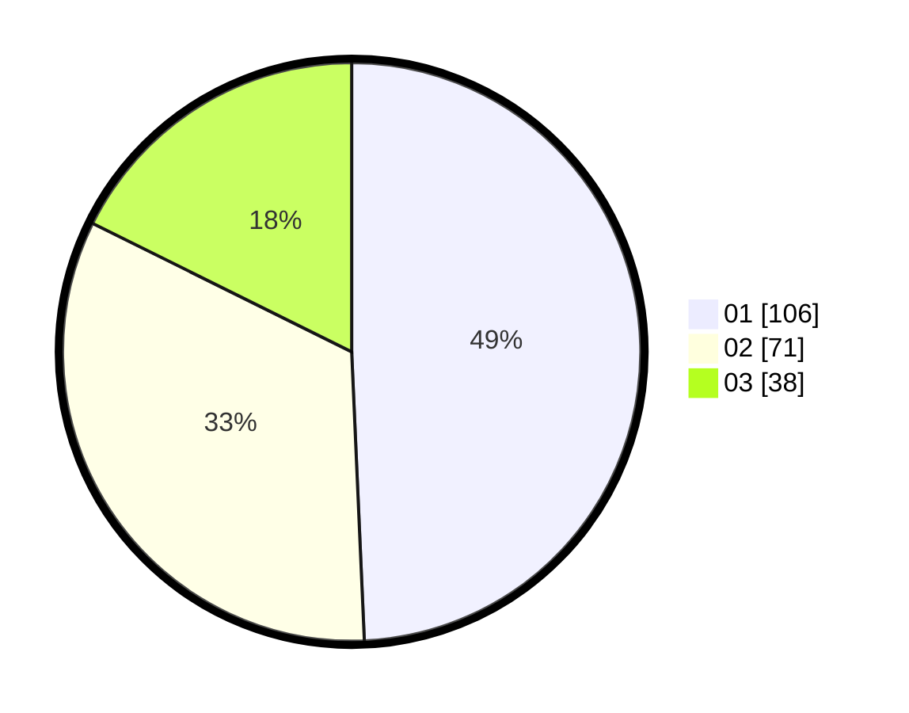

# Hasil

Hasil perolehan suara paslon dapat dilihat pada file paslon-01.txt, paslon-02.txt, dan paslon-03.txt.

Jika tidak ada, artinya data tersebut belum ada pada SIREKAP.

## Perolehan Suara

 * Paslon 01: **106**.
 * Paslon 02: **71**.
 * Paslon 03: **38**.

## Foto C Plano

https://sirekap-obj-formc.kpu.go.id/9272/pemilu/ppwp/31/75/07/10/02/3175071002111-20240214-193224--0f25285d-d20e-4706-b3cb-eea020e25fdd.jpg

https://sirekap-obj-formc.kpu.go.id/9272/pemilu/ppwp/31/75/07/10/02/3175071002111-20240214-221122--080b4504-eb6e-450a-aeae-8b8a885421c1.jpg

https://sirekap-obj-formc.kpu.go.id/9272/pemilu/ppwp/31/75/07/10/02/3175071002111-20240214-193832--c9b9b5eb-b98c-421e-bd6f-6dadad74c1d8.jpg

## DATA PEMILIH TETAP

Jumlah pemilih dalam DPT: **257**.
 * L: **122**.
 * P: **135**.

## DATA PENGGUNA HAK PILIH

Jumlah pengguna hak pilih dalam DPT: **209**.
 * L: **90**.
 * P: **119**.

Jumlah pengguna hak pilih dalam DPTb: **2**.
 * L: **1**.
 * P: **1**.

Jumlah pengguna hak pilih dalam DPK: **7**.
 * L: **0**.
 * P: **7**.

Jumlah pengguna hak pilih: **218**.
 * L: **91**.
 * P: **127**.

## JUMLAH SUARA SAH DAN TIDAK SAH

JUMLAH SELURUH SUARA SAH: **215**.

JUMLAH SUARA TIDAK SAH: **3**.

JUMLAH SELURUH SUARA SAH DAN SUARA TIDAK SAH: **218**.
