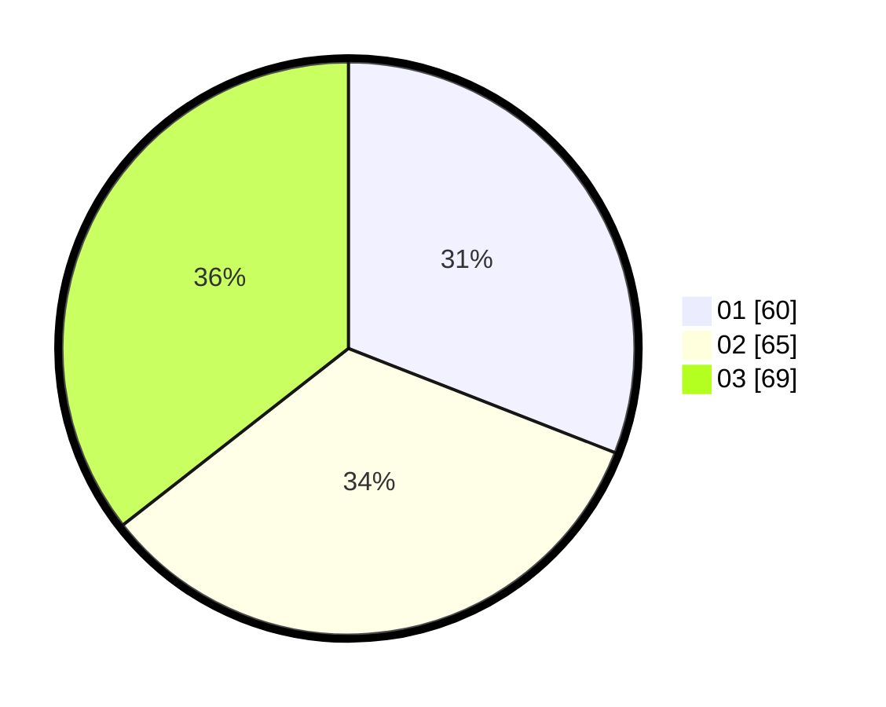

# Hasil

Hasil perolehan suara paslon dapat dilihat pada file paslon-01.txt, paslon-02.txt, dan paslon-03.txt.

Jika tidak ada, artinya data tersebut belum ada pada SIREKAP.

## Perolehan Suara

 * Paslon 01: **60**.
 * Paslon 02: **65**.
 * Paslon 03: **69**.

## Foto C Plano

https://sirekap-obj-formc.kpu.go.id/5759/pemilu/ppwp/31/75/07/10/02/3175071002112-20240216-152727--a96be25a-4a41-40f3-b530-d13b925b0a32.jpg

https://sirekap-obj-formc.kpu.go.id/5759/pemilu/ppwp/31/75/07/10/02/3175071002112-20240214-203859--1b88fbf1-1dfb-4145-89fa-1eb86f7f0c55.jpg

https://sirekap-obj-formc.kpu.go.id/5759/pemilu/ppwp/31/75/07/10/02/3175071002112-20240214-203917--82a0d992-e2a2-4ea5-8b5c-435e94f1d9c1.jpg

## DATA PEMILIH TETAP

Jumlah pemilih dalam DPT: **230**.
 * L: **108**.
 * P: **122**.

## DATA PENGGUNA HAK PILIH

Jumlah pengguna hak pilih dalam DPT: **187**.
 * L: **87**.
 * P: **100**.

Jumlah pengguna hak pilih dalam DPTb: **1**.
 * L: **0**.
 * P: **1**.

Jumlah pengguna hak pilih dalam DPK: **7**.
 * L: **4**.
 * P: **3**.

Jumlah pengguna hak pilih: **195**.
 * L: **91**.
 * P: **104**.

## JUMLAH SUARA SAH DAN TIDAK SAH

JUMLAH SELURUH SUARA SAH: **194**.

JUMLAH SUARA TIDAK SAH: **1**.

JUMLAH SELURUH SUARA SAH DAN SUARA TIDAK SAH: **195**.
