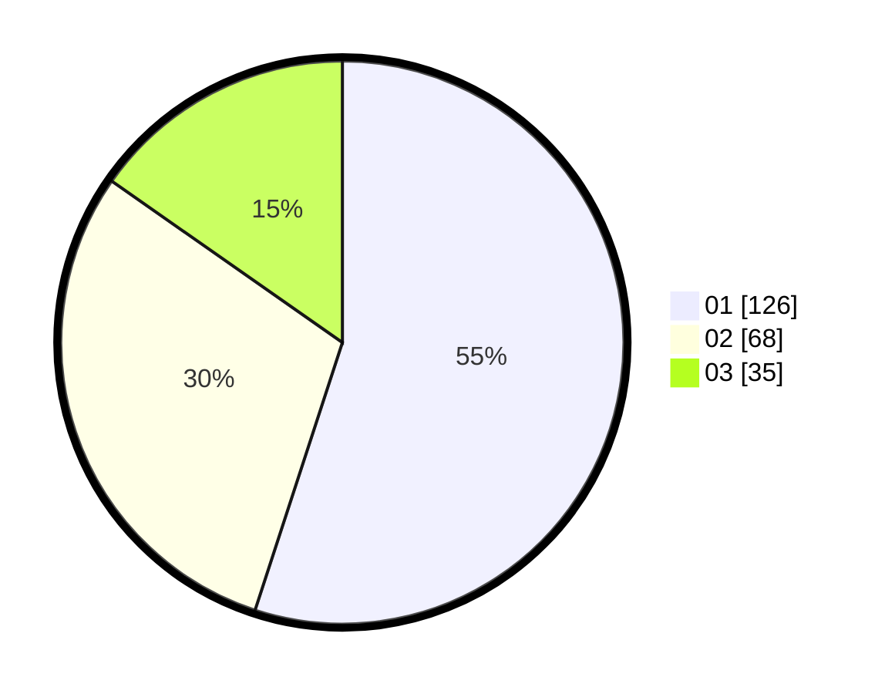

# Hasil

Hasil perolehan suara paslon dapat dilihat pada file paslon-01.txt, paslon-02.txt, dan paslon-03.txt.

Jika tidak ada, artinya data tersebut belum ada pada SIREKAP.

## Perolehan Suara

 * Paslon 01: **126**.
 * Paslon 02: **68**.
 * Paslon 03: **35**.

## Foto C Plano

https://sirekap-obj-formc.kpu.go.id/f27f/pemilu/ppwp/31/75/07/10/02/3175071002124-20240214-200152--49fa13c3-98dd-4b6c-bb71-50c0fd03c281.jpg

https://sirekap-obj-formc.kpu.go.id/f27f/pemilu/ppwp/31/75/07/10/02/3175071002124-20240214-190942--67f98e22-9b8a-4597-a7d1-1a980df8a213.jpg

https://sirekap-obj-formc.kpu.go.id/f27f/pemilu/ppwp/31/75/07/10/02/3175071002124-20240214-190748--490d89b7-0a8d-46ae-a6db-89189b83b6a7.jpg

## DATA PEMILIH TETAP

Jumlah pemilih dalam DPT: **285**.
 * L: **150**.
 * P: **135**.

## DATA PENGGUNA HAK PILIH

Jumlah pengguna hak pilih dalam DPT: **225**.
 * L: **111**.
 * P: **114**.

Jumlah pengguna hak pilih dalam DPTb: **1**.
 * L: **0**.
 * P: **1**.

Jumlah pengguna hak pilih dalam DPK: **5**.
 * L: **2**.
 * P: **3**.

Jumlah pengguna hak pilih: **231**.
 * L: **113**.
 * P: **118**.

## JUMLAH SUARA SAH DAN TIDAK SAH

JUMLAH SELURUH SUARA SAH: **229**.

JUMLAH SUARA TIDAK SAH: **2**.

JUMLAH SELURUH SUARA SAH DAN SUARA TIDAK SAH: **231**.
