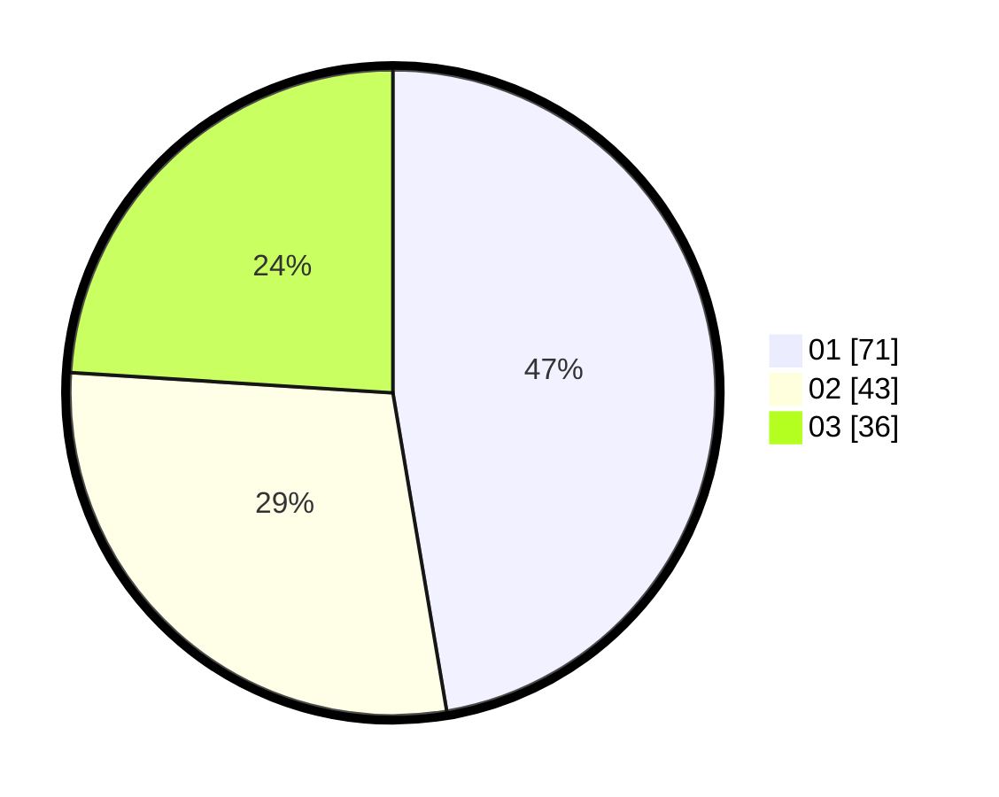

# Hasil

Hasil perolehan suara paslon dapat dilihat pada file paslon-01.txt, paslon-02.txt, dan paslon-03.txt.

Jika tidak ada, artinya data tersebut belum ada pada SIREKAP.

## Perolehan Suara

 * Paslon 01: **71**.
 * Paslon 02: **43**.
 * Paslon 03: **36**.

## Foto C Plano

https://sirekap-obj-formc.kpu.go.id/74a4/pemilu/ppwp/31/75/07/10/02/3175071002127-20240216-135641--e70d0384-b9c1-4e17-9498-184d7370ada0.jpg

https://sirekap-obj-formc.kpu.go.id/74a4/pemilu/ppwp/31/75/07/10/02/3175071002127-20240216-135642--033ad201-7eef-4fc3-a106-22d17f48752a.jpg

https://sirekap-obj-formc.kpu.go.id/74a4/pemilu/ppwp/31/75/07/10/02/3175071002127-20240216-135641--c6d2901c-e67f-4a51-b6b9-699409e71259.jpg

## DATA PEMILIH TETAP

Jumlah pemilih dalam DPT: **176**.
 * L: **88**.
 * P: **88**.

## DATA PENGGUNA HAK PILIH

Jumlah pengguna hak pilih dalam DPT: **152**.
 * L: **76**.
 * P: **76**.

Jumlah pengguna hak pilih dalam DPTb: **1**.
 * L: **1**.
 * P: **0**.

Jumlah pengguna hak pilih dalam DPK: **0**.
 * L: **0**.
 * P: **0**.

Jumlah pengguna hak pilih: **153**.
 * L: **77**.
 * P: **76**.

## JUMLAH SUARA SAH DAN TIDAK SAH

JUMLAH SELURUH SUARA SAH: **150**.

JUMLAH SUARA TIDAK SAH: **3**.

JUMLAH SELURUH SUARA SAH DAN SUARA TIDAK SAH: **153**.
